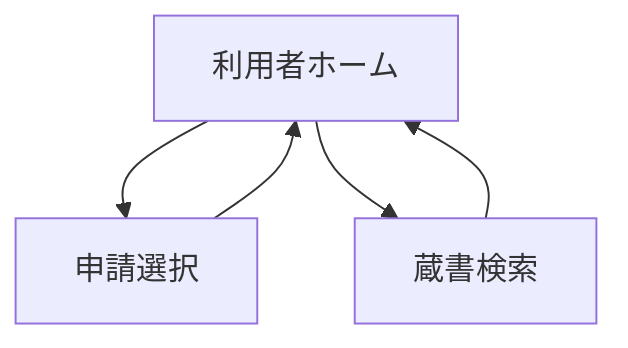
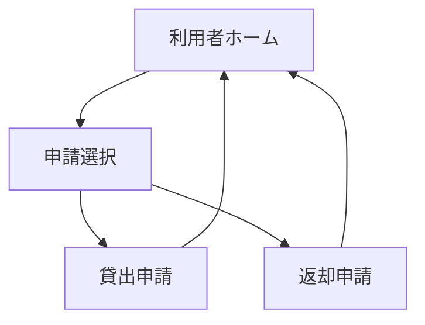
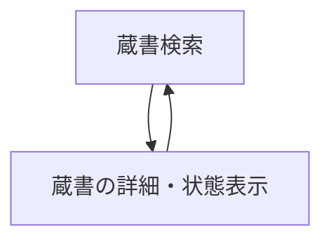
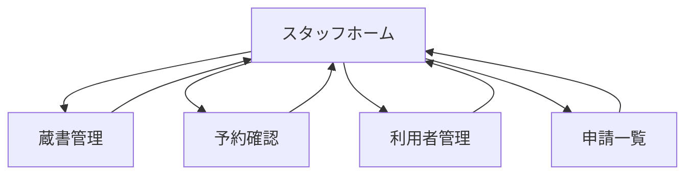
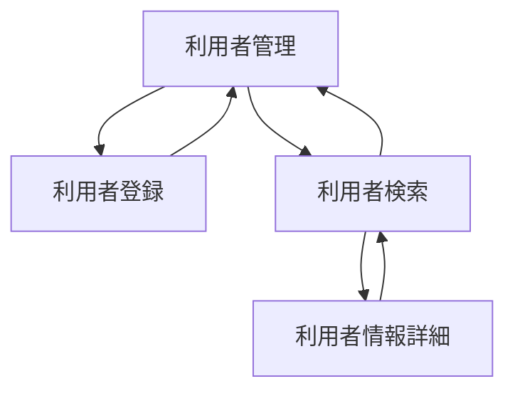

# 基本設計書

## システム概要

図書館利用者と図書館スタッフの両方が使用する図書館の蔵書管理システム。台帳の記入ミスや貸出中かどうかの確認に時間がかかる問題を解決するために導入する。蔵書の情報がシステムで管理され、蔵書の検索・貸出・返却・予約が行える。図書館利用者がシステムを利用するには利用者登録が必要になる。

## アクター

|アクター|説明|
|:---|:---|
|図書館利用者|本を借りる一般市民<br>システムを利用するには事前に窓口で利用者登録を行う必要がある|
|図書館スタッフ|貸出・返却の受け付け、蔵書・予約・利用者の管理を行う図書館職員|

## 機能一覧

### 利用者向け

#### 主な機能

|機能|説明|
|:---|:---|
|申請|貸出申請と返却申請を行うことができる機能|
|蔵書検索|蔵書をタイトル・著者名・ジャンルで検索できる機能<br>蔵書を検索して予約することができる|

##### 申請

|機能|説明|
|:---|:---|
|貸出申請|利用者が窓口で蔵書の貸出の申請を行うことができる機能|
|返却申請|利用者が窓口で蔵書の返却の申請を行うことができる機能|

##### 蔵書検索

|機能|説明|
|:---|:---|
|蔵書予約|利用者が蔵書の予約を行うことができる機能<br>蔵書の検索を行った後に予約ができる|

### スタッフ向け

---

#### 主な機能

|機能|説明|
|:---|:---|
|蔵書管理|蔵書の登録や検索を行うことができる機能|
|予約管理|予約の確認とキャンセルを行うことができる機能|
|利用者管理|利用者の登録と情報検索を行うことができる機能|
|申請管理|利用者の申請を確認し、承認することができる機能|

##### 蔵書管理

|機能|説明|
|---|---|
|蔵書登録|新しい蔵書をシステムに登録できる機能|
|蔵書検索|蔵書をタイトル・著者名・ジャンルで検索できる機能|

###### 蔵書検索

|機能|説明|
|---|---|
|蔵書の詳細編集|蔵書の情報（タイトルなど）を編集するための機能|

##### 予約管理

|機能|説明|
|---|---|
|予約の手動キャンセル|蔵書の予約を手動でキャンセルするための機能|
|予約の自動キャンセル|蔵書の予約を自動でキャンセルするための機能（蔵書返却後に予約者に連絡し、3日以内に来館がない場合にキャンセルが行われる）|

##### 利用者管理

|機能|説明|
|---|---|
|利用者登録|利用者の情報をシステムに登録できる機能|
|利用者検索|利用者の情報を検索する機能|

###### 利用者検索

|機能|説明|
|---|---|
|利用者情報編集|利用者の情報を編集する機能|
|利用者退会|利用者の情報をシステムから削除する機能|

##### 申請管理

|機能|説明|
|---|---|
|貸出処理|利用者の貸出申請を承認する機能|
|返却処理|利用者の返却申請を承認する機能|

###### 返却処理

|機能|説明|
|---|---|
|予約確認|返却処理完了後にその蔵書に次の予約者がいるかどうかを確認|

## 画面一覧

### 利用者画面



|画面ID|画面名|画面にある機能|説明|
|:---|:---|:---|:---|
|A001|利用者ホーム||申請一覧画面と蔵書検索画面に遷移するための画面|
|A002|申請選択||貸出申請と返却申請を一覧に表示する画面|
|A003|蔵書検索|蔵書検索|蔵書検索を行うための画面|

#### 申請選択画面



|画面ID|画面名|画面にある機能|説明|
|:---|:---|:---|:---|
|A002-1|貸出申請|貸出申請|蔵書の貸出の申請を行うための画面|
|A002-2|返却申請|返却申請|蔵書の返却の申請を行うための画面|

#### 蔵書検索一覧



|画面ID|画面名|画面にある機能|説明|
|:---|:---|:---|:---|
|A003-1|蔵書の詳細・状態表示|蔵書予約|蔵書の情報（タイトルなど）を表示する画面<br>貸出中の蔵書を予約することができる|

### スタッフ画面



|画面ID|画面名|画面にある機能|説明|
|:---|:---|:---|:---|
|B001|スタッフホーム||蔵書管理画面、予約確認画面、利用者管理画面、申請一覧画面に遷移するための画面|
|B002|蔵書管理||蔵書登録画面と蔵書検索画面に遷移するための画面|
|B003|予約確認|手動キャンセル<br>自動キャンセル|自動キャンセルされた予約と現在の予約を表示するための画面|
|B004|利用者管理||利用者登録画面と利用者検索画面に遷移するための画面|
|B005|申請一覧|貸出処理<br>返却処理|貸出と返却の承認を行うための画面|

#### 蔵書管理画面

  ```mermaid
  graph TD
      B002[蔵書管理] --> B002-1[蔵書登録]
      B002-1 --> B002
      B002 --> B002-2[蔵書検索]
      B002-2 --> B002
      B002-2 --> B002-2-1[蔵書の詳細・状態表示]
      B002-2-1 --> B002-2
  ```

|画面ID|画面名|画面にある機能|説明|
|:---|:---|:---|:---|
|B002-1|蔵書登録|蔵書登録|蔵書登録を行うための画面|
|B002-2|蔵書検索|蔵書検索|蔵書検索を行うための画面|

##### 蔵書検索画面

|画面ID|画面名|画面にある機能|説明|
|:---|:---|:---|:---|
|B002-2-1|蔵書の詳細・状態表示|蔵書の詳細編集|蔵書の情報を表示するための画面<br>蔵書の情報の編集を行うことができる|

#### 利用者管理画面



|画面ID|画面名|画面にある機能|説明|
|:---|:---|:---|:---|
|B004-1|利用者登録|利用者登録|新しい利用者の情報をシステムに登録する画面|
|B004-2|利用者検索|利用者検索|利用者の情報を検索する画面|

##### 利用者検索画面

|画面ID|画面名|画面にある機能|説明|
|:---|:---|:---|:---|
|B004-2-1|利用者情報詳細|利用者情報編集<br>利用者退会|利用者の情報詳細を表示する画面<br>利用者情報の編集と利用者の退会手続きを行うことができる|
