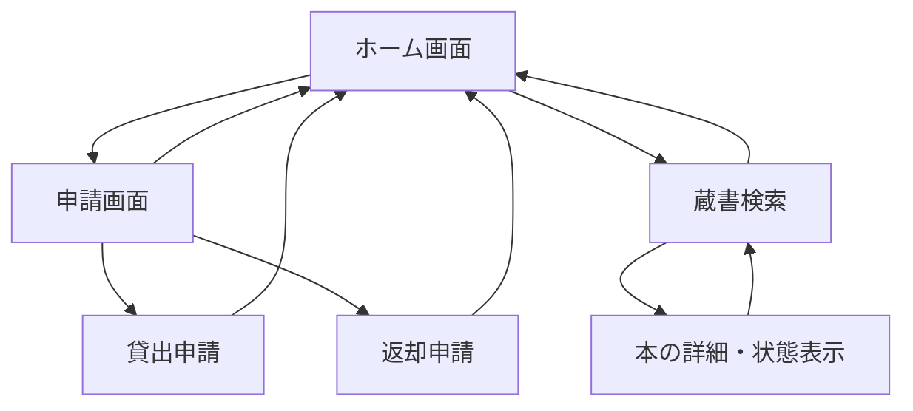
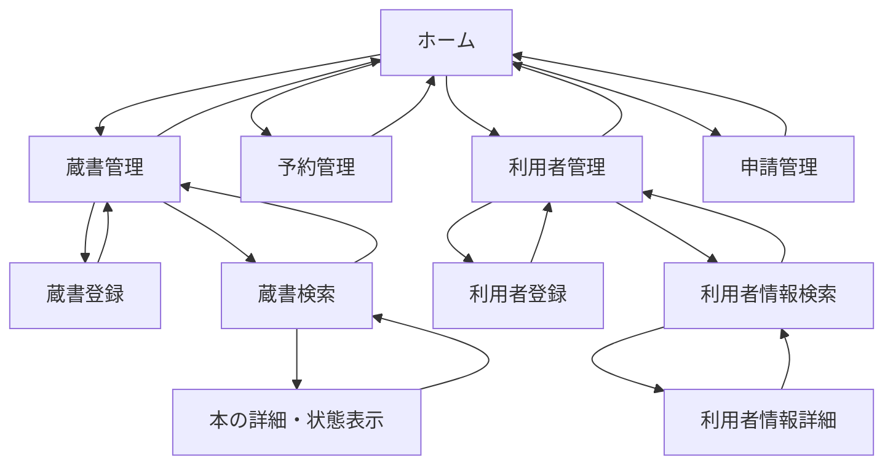
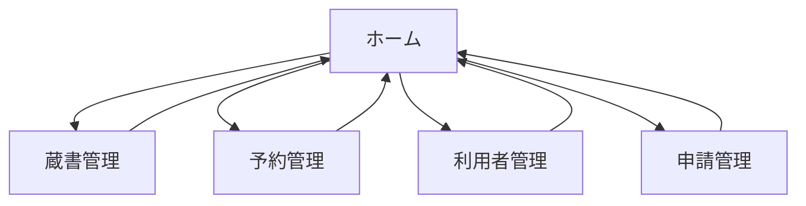

## 画面一覧

### 利用者画面

- ホーム画面
    - 申請画面
        - 貸出申請
        - 返却申請
    - 蔵書検索
        - 本の詳細・状態表示



### スタッフ画面

- ホーム
    - 蔵書管理
        - 蔵書登録
        - 蔵書検索
            - 本の詳細・状態表示
    - 予約管理
    - 利用者管理
        - 利用者登録
        - 利用者情報検索
            - 利用者情報詳細
    - 申請管理



- 大枠の画面遷移図



- 蔵書管理と利用者管理の画面の画面遷移図
  - 蔵書管理

  ```mermaid
  graph TD
      B002[蔵書管理] --> B002-1[蔵書登録]
      B002-1 --> B002
      B002 --> B002-2[蔵書検索]
      B002-2 --> B002
      B002-2 --> B002-2-1[本の詳細・状態表示]
      B002-2-1 --> B002-2
  ```

  - 利用者管理

  ```mermaid
  graph TD
      B004[利用者管理] --> B004-1[利用者登録]
      B004-1 --> B004
      B004 --> B004-2[利用者情報検索]
      B004-2 --> B004
      B004-2 --> B004-2-1[利用者情報詳細]
      B004-2-1 --> B004-2
  ```
