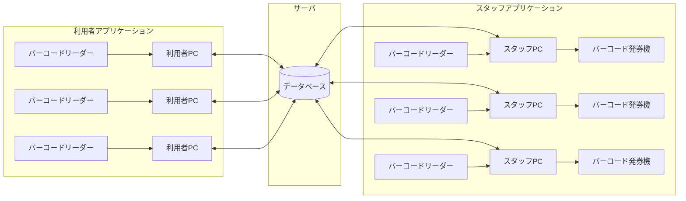
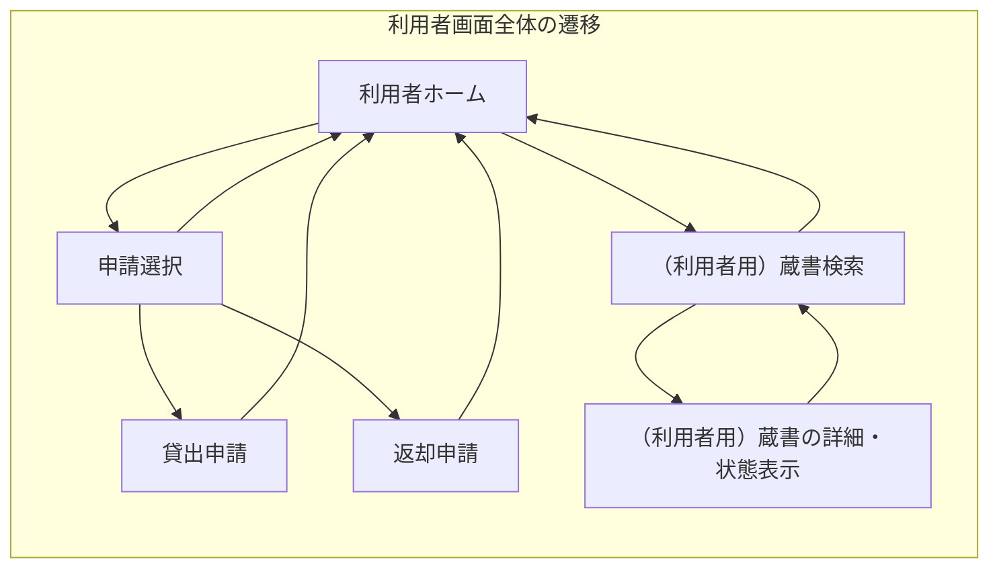
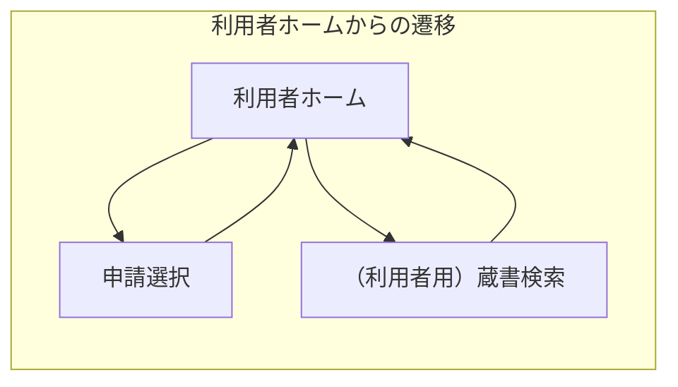
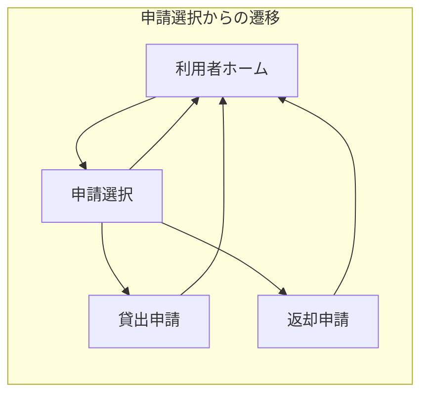
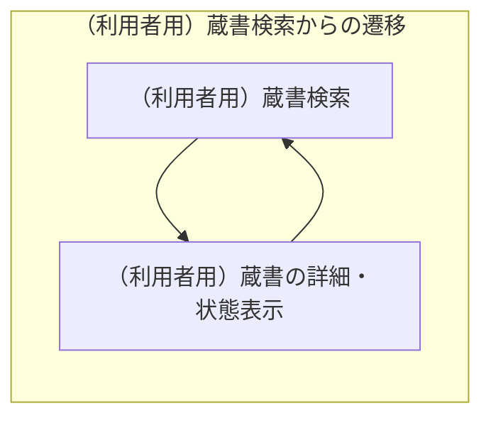
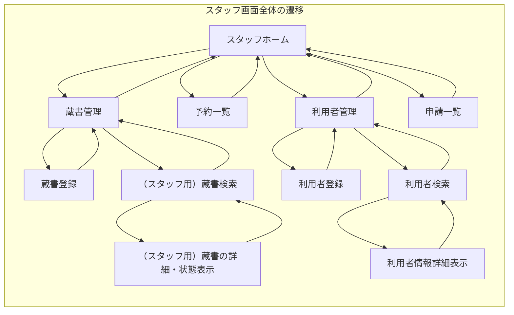
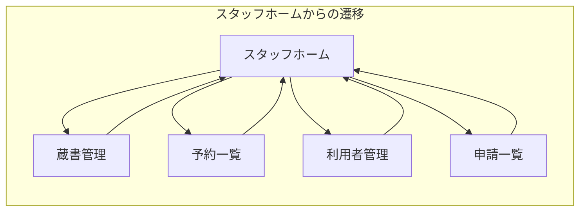
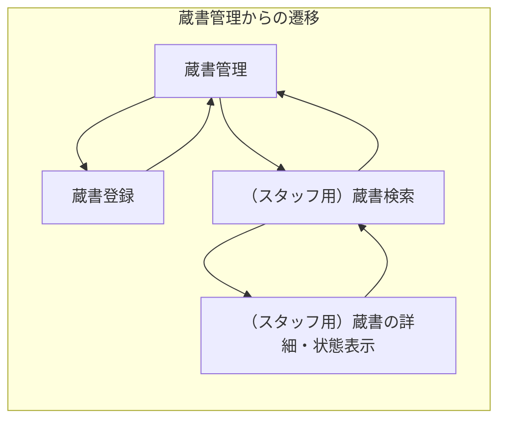
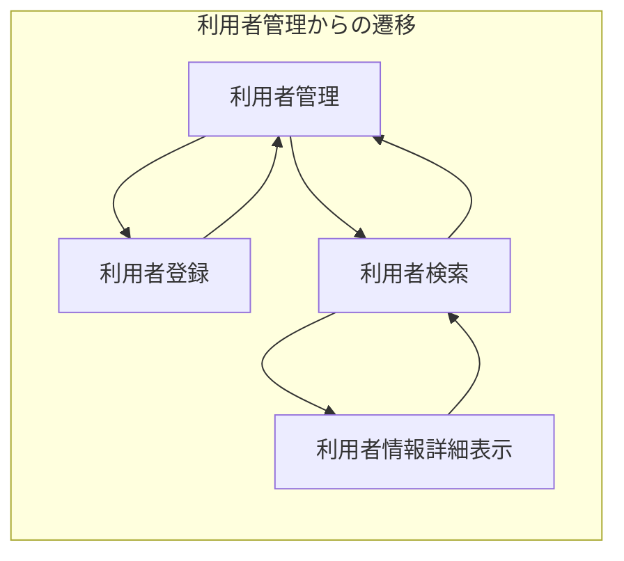

<h1>基本設計書</h1>

<h2>目次</h2>

- [システム概要](#システム概要)
  - [アクター定義](#アクター定義)
  - [システム構成図](#システム構成図)
  - [システムの管理情報](#システムの管理情報)
- [機能一覧](#機能一覧)
- [画面一覧](#画面一覧)

## システム概要

図書館利用者と図書館スタッフの両方が使用する図書館の蔵書管理システム。台帳の記入ミスや貸出中かどうかの確認に時間がかかる問題を解決するために導入する。 スタッフと利用者はそれぞれ別のアプリケーションを使用し、それぞれのアプリケーションは1つのデータベースを共有している。

### アクター定義

|アクター|説明|
|:---|:---|
|図書館利用者(利用者)|本を借りる一般市民 利用者がアプリケーションを利用するには事前に窓口で利用者登録を行う必要がある 登録の際にはスタッフが利用者のユーザー名、メールアドレスをシステムに登録し、利用者には個別の利用者IDが割り振られる|
|図書館スタッフ(スタッフ)|貸出・返却の受け付け、蔵書・予約・利用者の管理を行う図書館職員|

### システム構成図

以下にシステムの構成図を示す

- 利用者アプリケーションとスタッフアプリケーションは複数のPCで使用でき、1つのデータベースを共有する。
- 各PCにはバーコードリーダーが接続されている。
- 各スタッフ用PCにはバーコード発券機が接続されている。

### システム利用時の流れ

以下にシステムを利用したときの流れを示す

#### 貸出

- 貸出の際には利用者が利用者用アプリケーションで申請を作成し、スタッフがスタッフ用アプリケーションでその申請を承認する

#### 返却

#### 予約

#### 蔵書登録

#### 利用者登録

#### 退会

### システムの管理情報

以下にシステムの管理情報を示す

<h4>蔵書の情報</h4>

|項目|説明|
|:---|:---|
|蔵書ID|蔵書をシステムに登録する際に自動で設定される数値 同じ蔵書が複数ある場合でも違うIDで管理する 登録時に蔵書IDに紐づくバーコードが発券され、蔵書IDはバーコードを読み込むことで入力を行う 重複不可|
|タイトル|蔵書のタイトル 重複可|
|著者名|蔵書の著者の名前 重複可|
|ジャンル|蔵書のジャンル 蔵書のジャンルはジャンル名のリストで管理する 重複可|
|あらすじ|蔵書のあらすじ 重複可|
|貸出状態|蔵書の状態 貸出中と貸出可能の2つの状態をもつ|

<h4>利用者の情報</h4>

|項目|説明|
|:---|:---|
|利用者ID|利用者をシステムに登録する際に自動で設定される数値 重複不可|
|ユーザー名|利用者の名前 利用者の本名以外でも登録できる 重複可|
|メールアドレス|利用者のメールアドレス 重複不可|

## 機能一覧

<h3>利用者向け機能一覧</h3>

|機能|説明|
|:---|:---|
|申請|貸出申請と返却申請を行うことができる機能 利用者は一度に複数の蔵書に対して申請を行うことができる 利用者は申請機能利用時に利用者ID、ユーザー名、蔵書IDを入力する|
|(利用者用)蔵書検索|蔵書をタイトル・著者名・ジャンルで検索できる機能 利用者は蔵書を検索した後に蔵書を予約することができる 検索は部分一致、and検索で行い、利用者がいずれかの項目を入力していれば検索を行える 検索の際利用者はジャンルをリストから選択する|

<h4>申請</h4>

|機能|説明|
|:---|:---|
|貸出申請|蔵書の貸出の申請を行うことができる機能 借りている蔵書数が3冊を超えるような申請を行うことができない|
|返却申請|蔵書の返却の申請を行うことができる機能|

<h4>(利用者用)蔵書検索</h4>

|機能|説明|
|:---|:---|
|蔵書予約|蔵書の予約を行うことができる機能 利用者は予約時に利用者ID、ユーザー名を入力する 利用者は自分が借りている蔵書に対して予約を行うことができない 利用者はすでに自分が1冊予約している場合は予約を行うことができない 貸出状態が貸出中の蔵書のみ予約することができる|

<h3>スタッフ向け機能一覧</h3>

|機能|説明|
|:---|:---|
|蔵書管理|蔵書の登録や検索を行うことができる機能|
|予約管理|予約の確認とキャンセルを行うことができる機能 予約者が窓口に来た場合、利用者に該当の蔵書に対しての貸出申請を作成してもらう 利用者が予約をキャンセルする際には窓口で直接スタッフに依頼する|
|利用者管理|利用者の登録、退会、検索を行うことができる機能|
|申請管理|利用者の申請を確認し、承認または拒否することができる機能|

<h4>蔵書管理</h4>

|機能|説明|
|:---|:---|
|蔵書登録|新しい蔵書をシステムに登録することができる機能 登録時に蔵書の情報(ID以外)を入力する 新しいジャンルの登録や既存のジャンルの削除を行うことができる 現在使用しているジャンルは削除できない 登録完了後には蔵書IDが紐づいたバーコードを発券する|
|(スタッフ用)蔵書検索|蔵書をタイトル・著者名・ジャンル、蔵書IDで検索することができる機能 部分一致、and検索で行い、いずれかに入力があれば検索を行える|

<h5>(スタッフ用)蔵書検索</h5>

|機能|説明|
|:---|:---|
|蔵書の詳細編集|蔵書の情報（ID以外）を編集することができる機能|

<h4>予約管理</h4>

|機能|説明|
|:---|:---|
|予約検索|予約を利用者IDで検索することができる機能 検索は完全一致で行う|
|予約の手動キャンセル|蔵書の予約を手動でキャンセルすることができる機能 予約がキャンセルされた蔵書に次の予約者がいる場合は自動でメールを送信する|
|予約の自動キャンセル|蔵書の予約を自動でキャンセルすることができる機能（返却後または予約キャンセル後に予約者にメールが送信され、その日を0日目として休館日を除く3日目の営業終了時間まで予約された蔵書が貸し出されていない場合に予約が自動キャンセルされる） 予約がキャンセルされた蔵書に次の予約者がいる場合は予約者に自動でメールを送信する|

<h4>利用者管理</h4>

|機能|説明|
|:---|:---|
|利用者登録|利用者の情報をシステムに登録することができる機能 登録の際には利用者はユーザー名とメールアドレスを入力し、利用者IDが割り振られる すでに登録されているメールアドレスは登録できない|
|利用者検索|利用者の情報を利用者ID、ユーザー名、メールアドレスで検索することができる機能 部分一致、and検索で行い、いずれかに入力があれば検索を行える|

<h5>利用者検索</h5>

|機能|説明|
|:---|:---|
|利用者情報編集|利用者の情報（ID以外）を編集することができる機能 メールアドレスを編集する場合は、他の利用者が使用しているメールアドレスと同じものに変更することはできない|
|利用者退会|利用者の情報をシステムから削除することができる機能 現在貸出中または予約中の蔵書がある利用者は退会を行えない|

<h4>申請管理</h4>

|機能|説明|
|:---|:---|
|貸出処理|利用者の貸出申請を承認または拒否することができる機能 蔵書IDを入力し、申請内容と一致した場合のみ申請を承認できる 承認、拒否された申請は削除され、承認の場合には貸出状態を貸出中に変更する|
|返却処理|利用者の返却申請を承認または拒否することができる機能 蔵書IDを入力し、申請内容と一致した場合のみ申請を承認できる 承認、拒否された申請は削除され、承認の場合には貸出状態を貸出可能に変更する 承認後に次の予約者がいる場合は予約者に自動でメールを送信する|

## 画面一覧

<h3>利用者用画面の構成</h3>

<h4>利用者ホーム画面</h4>

|画面ID|画面名|画面にある機能|説明|
|:---|:---|:---|:---|
|U001|利用者ホーム||利用者が行う操作を選択する画面|
|U002|申請選択||行う申請の種類を選択する画面|
|U003|(利用者用)蔵書検索|(利用者用)蔵書検索|蔵書検索を行うことができる画面 検索結果が蔵書ID昇順で一覧で表示される 一覧には蔵書のタイトル、著者名、ジャンルを表示する 何も検索していない状態ではすべての蔵書を蔵書ID昇順で表示する ジャンルはリストから選択 検索内容にヒットしなければ一覧は表示されない|

<h4>申請選択画面からの遷移</h4>

|画面ID|画面名|画面にある機能|説明|
|:---|:---|:---|:---|
|U002-1|貸出申請|貸出申請|蔵書の貸出の申請を行うことができる画面|
|U002-2|返却申請|返却申請|蔵書の返却の申請を行うことができる画面|

<h4>(利用者用)蔵書検索画面からの遷移</h4>

|画面ID|画面名|画面にある機能|説明|
|:---|:---|:---|:---|
|U003-1|(利用者用)蔵書の詳細・状態表示|蔵書予約|蔵書の情報（ID以外）予約人数、現在貸出中の場合は返却期限(貸出日を0日目として休館日を含めた2週間後の営業終了時間まで)を表示する画面|

<h3>スタッフ用画面の構成</h3>

<h4>スタッフホーム画面</h4>

|画面ID|画面名|画面にある機能|説明|
|:---|:---|:---|:---|
|S001|スタッフホーム||スタッフが行う操作を選択する画面|
|S002|蔵書管理||蔵書の登録、検索のどちらを行うか選択する画面|
|S003|予約一覧|予約の手動キャンセル 予約者検索|現在の予約状況を予約日時の昇順で一覧で表示することができる画面 現在の予約を手動でキャンセルすることができる 予約者検索後は検索された利用者IDの利用者の予約のみが表示される|
|S004|利用者管理||利用者の登録、検索のどちらを行うかを選択する画面|
|S005|申請一覧|貸出処理 返却処理|利用者の申請が申請日時の昇順で一覧で表示される画面 貸出と返却の承認または拒否を行うことができる 返却申請承認後、返却された蔵書に次の予約者がいる場合は予約者の情報をポップアップで表示する|

<h4>蔵書管理画面からの遷移</h4>

|画面ID|画面名|画面にある機能|説明|
|:---|:---|:---|:---|
|S002-1|蔵書登録|蔵書登録|蔵書登録を行うことができる画面|
|S002-2|(スタッフ用)蔵書検索|(スタッフ用)蔵書検索|蔵書検索を行うことができる画面 検索結果が蔵書ID昇順で一覧で表示される 何も検索していない状態ではすべての蔵書を蔵書ID昇順で表示する 検索内容にヒットしなければ一覧は表示されない|

<h5>(スタッフ用)蔵書検索画面からの遷移</h5>

|画面ID|画面名|画面にある機能|説明|
|:---|:---|:---|:---|
|S002-2-1|(スタッフ用)蔵書の詳細・状態表示|蔵書の詳細編集|蔵書の情報を表示する画面 蔵書の情報（ID以外）の編集を行うことができる|

<h4>利用者管理画面からの遷移</h4>

|画面ID|画面名|画面にある機能|説明|
|:---|:---|:---|:---|
|S004-1|利用者登録|利用者登録|新しい利用者の情報をシステムに登録することができる画面|
|S004-2|利用者検索|利用者検索|利用者の情報を検索することができる画面 検索結果が利用者ID昇順で一覧で表示される 何も検索していない状態ではすべての利用者を利用者ID昇順で表示する 検索内容にヒットしなければ一覧は表示されない|

<h5>利用者検索画面からの遷移</h5>

|画面ID|画面名|画面にある機能|説明|
|:---|:---|:---|:---|
|S004-2-1|利用者情報詳細表示|利用者情報編集 利用者退会|利用者の情報詳細を表示する画面 利用者の情報（ID以外）の編集と利用者の退会手続きを行うことができる|
