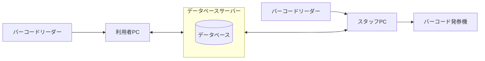
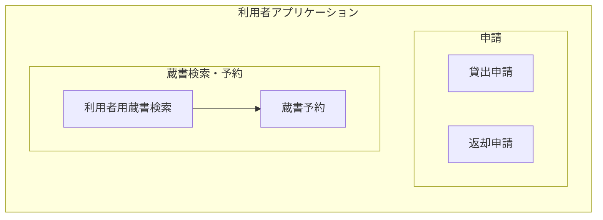
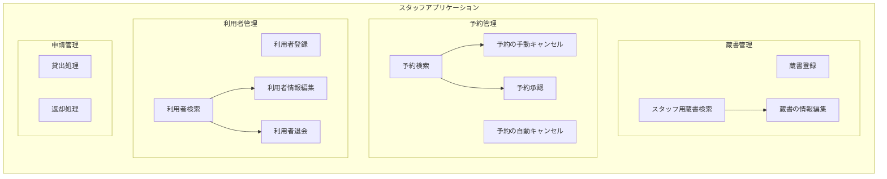
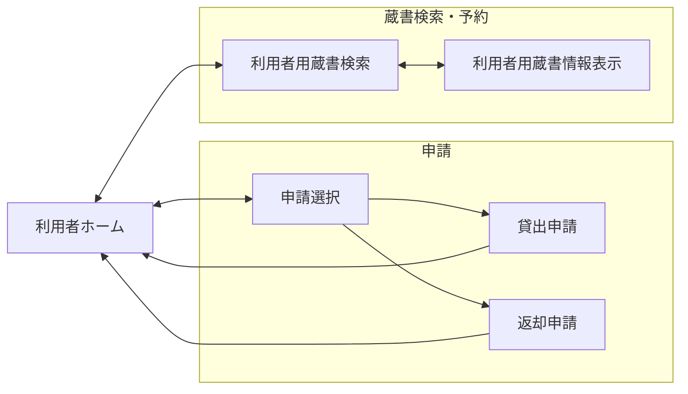
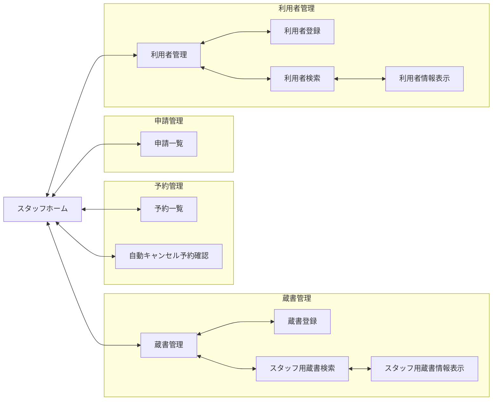

<h1>基本設計書</h1>

<h2>目次</h2>

- [システム概要](#システム概要)
- [システム構成](#システム構成)
  - [アクター定義](#アクター定義)
  - [システム構成図](#システム構成図)
  - [用語定義](#用語定義)
- [システム利用時の流れ](#システム利用時の流れ)
  - [貸出](#貸出)
  - [返却](#返却)
  - [蔵書の予約](#蔵書の予約)
  - [予約した蔵書の貸出](#予約した蔵書の貸出)
  - [予約のキャンセル](#予約のキャンセル)
  - [蔵書の登録](#蔵書の登録)
  - [蔵書の情報編集](#蔵書の情報編集)
  - [利用者の登録](#利用者の登録)
  - [利用者の退会](#利用者の退会)
  - [利用者の情報編集](#利用者の情報編集)
- [機能設計](#機能設計)
  - [利用者アプリケーション](#利用者アプリケーション)
    - [機能一覧](#機能一覧)
    - [機能関係図](#機能関係図)
    - [各機能の説明](#各機能の説明)
  - [スタッフアプリケーション](#スタッフアプリケーション)
    - [機能一覧](#機能一覧-1)
    - [機能関係図](#機能関係図-1)
    - [各機能の説明](#各機能の説明-1)
- [画面設計](#画面設計)
  - [利用者アプリケーション](#利用者アプリケーション-1)
    - [画面一覧](#画面一覧)
    - [画面遷移図](#画面遷移図)
    - [各画面の説明](#各画面の説明)
  - [スタッフアプリケーション](#スタッフアプリケーション-1)
    - [画面一覧](#画面一覧-1)
    - [画面遷移図](#画面遷移図-1)
    - [各画面の説明](#各画面の説明-1)

## システム概要

図書館利用者と図書館スタッフの両方が使用する図書館の蔵書管理システム。台帳の記入ミスや貸出中かどうかの確認に時間がかかる問題の解決を目的とする。 図書館スタッフと図書館利用者はそれぞれ別のアプリケーションを使用し、それぞれのアプリケーションはデータベースサーバーを介して同一データベースへアクセスする。

## システム構成

### アクター定義

以下にシステムを利用するアクターの定義を示す

|アクター|説明|
|:---|:---|
|図書館利用者(利用者)|蔵書を借りる一般市民 利用者が貸出、返却、予約を行うには事前に窓口で利用者登録を行う必要がある|
|図書館スタッフ(スタッフ)|貸出・返却の受け付け、蔵書・予約・利用者の管理を行う図書館職員|

### システム構成図

以下にシステムの構成図を示す

- 利用者PCでは利用者アプリケーションを使用する
- スタッフPCではスタッフアプリケーションを使用する
- 利用者アプリケーションとスタッフアプリケーションは複数のPCで使用でき、1つのデータベースを共有する
- 各PCにはバーコードリーダーが接続されている
- 各スタッフPCにはバーコード発券機が接続されている

### 用語定義

以下に用語定義を示す

<h4>蔵書の情報</h4>

|項目|説明|
|:---|:---|
|蔵書ID|蔵書をシステムに登録する際に自動で設定される数値 同じタイトルの蔵書が複数ある場合でも異なる蔵書IDで管理する 登録時に蔵書IDに紐づくバーコードが発券され、蔵書IDはバーコードを読み込むことで入力を行う 重複不可|
|タイトル|蔵書のタイトル 重複可|
|著者名|蔵書の著者の名前 重複可|
|ジャンル|蔵書のジャンル 蔵書のジャンルはジャンル名のリストで管理する 重複可|
|あらすじ|蔵書のあらすじ 重複可|
|貸出状態|蔵書の貸出状態 貸出中と貸出可能のどちらかの状態をもつ|
|予約状態|蔵書の予約状態 予約ありと予約なしのどちらかの状態をもつ|

<h4>利用者の情報</h4>

|項目|説明|
|:---|:---|
|利用者ID|利用者をシステムに登録する際に自動で設定される数値 重複不可|
|名前|利用者の名前 重複可|
|パスワード|登録時に利用者が設定するパスワード 重複可|
|メールアドレス|利用者のメールアドレス 重複可|
|住所|利用者の住所 重複可|

## システム利用時の流れ

以下にシステム利用時の流れを示す

### 貸出

1. 利用者は借りたい蔵書を手元に用意する
2. 利用者は利用者PCで蔵書のバーコードを読み込み、自分の利用者IDとパスワードを入力し、貸出申請を行う
3. 貸出申請を行った利用者は蔵書を持って窓口に行く
4. スタッフはスタッフPCで蔵書のバーコードの読み込み・利用者IDの入力を行い、利用者の貸出申請内容と一致するか確認する
5. スタッフが利用者の申請を承認し、蔵書を貸し出す

### 返却

1. 利用者は返却したい蔵書を手元に用意する
2. 利用者は利用者PCで蔵書のバーコードを読み込み、自分の利用者IDとパスワードを入力し、返却申請を行う
3. 返却申請を行った利用者は蔵書を持って窓口に行く
4. スタッフはスタッフPCで蔵書のバーコードの読み込み・利用者IDの入力を行い、利用者の返却申請内容と一致するか確認する
5. スタッフは利用者の返却申請を承認し、蔵書を受け取る
    - 受け取った蔵書に次の予約者がいる場合、蔵書を取り置く
    - 受け取った蔵書に次の予約者がいない場合、蔵書を本棚に戻す

### 蔵書の予約

1. 利用者は利用者PCで予約したい蔵書を検索する
2. 検索後、自分の利用者IDとパスワードを入力し、蔵書の予約を行う

### 予約した蔵書の貸出

1. 利用者は窓口のスタッフに自分の利用者IDを伝える
2. スタッフはスタッフPCで予約を検索する
3. スタッフは予約されている蔵書を利用者に渡し、該当の予約の承認を行う
4. 以降、貸出の時と同じ流れで申請を行い、蔵書の貸出を行う

### 予約のキャンセル

1. 利用者は窓口のスタッフに自分の利用者IDを伝える
2. スタッフは利用者IDで予約を検索し、該当の予約をキャンセルする
    - 予約がキャンセルされた蔵書に次の予約者がいる場合、蔵書を取り置く
    - 予約がキャンセルされた蔵書に次の予約者がいない場合、蔵書を本棚に戻す

### 蔵書の登録

1. スタッフはスタッフPCに新しい蔵書のタイトル・著者名・あらすじを入力し、ジャンルを選択する
2. 入力した情報をシステムに登録する
3. 登録が完了すると、蔵書IDが紐づくバーコードが発券されるので、そのバーコードを蔵書に張り付ける

### 蔵書の情報編集

1. スタッフはスタッフPCで蔵書を検索する
2. 検索した蔵書のタイトル・著者名・あらすじを編集、ジャンルを変更する

### 利用者の登録

1. 利用者は窓口にて名前・パスワード・メールアドレス・住所を紙に記入し、スタッフに渡す
2. 利用者は住所が記載されている本人確認書類をスタッフに提示し、スタッフは名前と住所を確認する（未成年で住所が記載されている本人確認書類がない場合は保護者同伴で保護者の書類と登録する本人の名前が確認できる書類で確認を行える）
3. スタッフはスタッフPCに名前・パスワード・メールアドレス・住所を入力する
4. 入力した情報をシステムに登録する(登録の際、利用者IDが自動で割り当てられる)
5. スタッフは利用者に割り当てられた利用者IDが記述された会員証を利用者に渡す(会員証は利用者が自分の利用者IDを確認するためのもの)

### 利用者の退会

1. 利用者は窓口のスタッフに自分の利用者IDを伝える
2. スタッフはスタッフPCで利用者を検索する
3. 検索した利用者の情報を削除する

### 利用者の情報編集

1. スタッフはスタッフPCで利用者を検索する
2. スタッフは検索した利用者の名前・パスワード・メールアドレス・住所を編集する(名前・住所を変更する際には登録の時と同じように本人確認を行う)

## 機能設計

以下にシステムの機能について示す

### 利用者アプリケーション

以下に利用者アプリケーションの機能について示す

#### 機能一覧

- 貸出申請
- 返却申請
- 利用者用蔵書検索
- 蔵書予約

#### 機能関係図

以下に利用者アプリケーションの機能関係図を示す

#### 各機能の説明

以下に各機能の説明を示す

- 申請

    |機能|説明|
    |:---|:---|
    |貸出申請|蔵書の貸出の申請を行うことができる機能 一度に複数の蔵書に対して申請を行うことができる 貸出状態が貸出可能の蔵書のみ貸出申請を行うことができる 利用者は自分が借りている蔵書数と申請中の蔵書数の合計が3冊を超えるような申請を行うことができない 利用者は申請機能利用時に蔵書ID・利用者ID・パスワードを入力する|
    |返却申請|蔵書の返却の申請を行うことができる機能 一度に複数の蔵書に対して申請を行うことができる 貸出状態が貸出中の蔵書のみ返却申請を行うことができる 利用者は自分が借りている蔵書に対してのみ返却申請を行うことができる 利用者は申請機能利用時に蔵書ID・利用者ID・パスワードを入力する|

- 蔵書検索・予約

    |機能|説明|
    |:---|:---|
    |利用者用蔵書検索|蔵書をタイトル・著者名・ジャンルで検索できる機能 検索はジャンル以外は部分一致、ジャンルは完全一致、and検索で行う 利用者はいずれかの項目を入力していなければ検索を行うことができない 利用者は検索の際、ジャンルをリストから選択する|
    |蔵書予約|蔵書の予約を行うことができる機能 貸出状態が貸出中または予約状態が予約ありの蔵書のみ予約することができる 予約の際に予約状態が予約なしの場合は予約ありに変更する 利用者は予約時に利用者ID・パスワードを入力する 利用者は自分が借りている蔵書に対して予約を行うことができない 利用者はすでに自分が1冊予約している場合は予約を行うことができない|

### スタッフアプリケーション

以下にスタッフアプリケーションの機能について示す

#### 機能一覧

- 蔵書登録
- スタッフ用蔵書検索
- 蔵書の情報編集
- 予約検索
- 予約承認
- 予約の手動キャンセル
- 予約の自動キャンセル
- 利用者登録
- 利用者検索
- 利用者情報編集
- 利用者退会
- 貸出処理
- 返却処理

#### 機能関係図

以下にスタッフアプリケーションの機能関係図を示す

#### 各機能の説明

- 蔵書管理

    |機能|説明|
    |:---|:---|
    |蔵書登録|新しい蔵書をシステムに登録することができる機能 蔵書が登録された際には自動で蔵書IDが割り当てられ、貸出状態が貸出可能、予約状態が予約なしに設定される 新しいジャンルの登録や既存のジャンルの削除を行うことができる 現在いずれかの蔵書に設定されているジャンルは削除できない 登録完了後には蔵書IDが紐づいたバーコードを発券する スタッフは登録時に蔵書のタイトル・著者名・あらすじを入力し、ジャンルを選択する スタッフはいずれかの項目が空欄の状態で登録を完了できない|
    |スタッフ用蔵書検索|蔵書をタイトル・著者名・ジャンル・蔵書IDで検索することができる機能 検索はジャンル以外は部分一致、ジャンルは完全一致、and検索で行う スタッフはいずれかの項目を入力していなければ検索を行うことができない スタッフは検索の際、ジャンルをリストから選択する|
    |蔵書の情報編集|蔵書のタイトル・著者名・あらすじを編集、ジャンルを変更することができる機能 スタッフはいずれかの項目が空欄の状態で編集を終了できない|

- 予約管理

    |機能|説明|
    |:---|:---|
    |予約検索|予約を利用者IDで検索することができる機能 検索は完全一致で行う|
    |予約承認|蔵書の予約を承認できる機能 蔵書の予約を承認し、予約を削除する 予約を削除した際に次の予約者がいない場合は予約状態を予約なしに変更する|
    |予約の手動キャンセル|蔵書の予約を手動でキャンセルすることができる機能 蔵書の予約をキャンセルし、予約を削除する 予約キャンセルの際に次の予約者がいない場合は予約状態を予約なしに変更する 予約がキャンセルされた蔵書に次の予約者がいる場合は予約者に自動でメールを送信する|
    |予約の自動キャンセル|蔵書の予約を自動でキャンセルする機能 メールが送信された日を0日目として3営業日以内に蔵書が貸し出されていない場合に予約が自動キャンセルされる 蔵書に次の予約者がいる場合、予約を削除し、次の予約者に自動でメールを送信する 予約キャンセルの際に次の予約者がいない場合は予約状態を予約なしに変更する（次の予約者がいない場合は本棚に蔵書を戻す必要があるのでスタッフが確認するために予約を削除しない）|

- 利用者管理

    |機能|説明|
    |:---|:---|
    |利用者登録|利用者の情報をシステムに登録することができる機能 利用者が登録された際には自動で利用者IDが割り振られる 名前・住所の組み合わせがすでに登録されている場合登録を行うことができない スタッフは登録の際に名前・パスワード・メールアドレス・住所を入力する スタッフは名前・パスワード・メールアドレス・住所のいずれかの項目が空欄の状態で登録を完了できない|
    |利用者検索|利用者の情報を利用者ID・名前・メールアドレスで検索することができる機能 部分一致、and検索で行う スタッフはいずれかの項目を入力していなければ検索を行うことができない|
    |利用者情報編集|利用者の名前・パスワード・メールアドレス・住所を編集することができる機能 名前・住所の組み合わせはすでに登録されているものに変更することはできない スタッフは名前・パスワード・メールアドレス・住所のいずれかの項目が空欄の状態で編集を終了できない|
    |利用者退会|利用者の情報をシステムから削除することができる機能 現在貸出中または予約中の蔵書がある利用者の退会を行うことができない|

- 申請管理

    |機能|説明|
    |:---|:---|
    |貸出処理|利用者の貸出申請を承認または拒否することができる機能 承認、拒否された申請は削除され、承認の場合には貸出状態を貸出中に変更する スタッフは蔵書IDと利用者IDを入力し、申請内容と一致した場合のみ申請を承認できる|
    |返却処理|利用者の返却申請を承認または拒否することができる機能 承認、拒否された申請は削除され、承認の場合には貸出状態を貸出可能に変更する 承認後に次の予約者がいる場合は予約者に自動でメールを送信する スタッフは蔵書IDと利用者IDを入力し、申請内容と一致した場合のみ申請を承認できる|

## 画面設計

以下にシステムの画面について示す

### 利用者アプリケーション

以下に利用者アプリケーションの画面について示す

#### 画面一覧

- 利用者ホーム
- 申請選択
- 貸出申請
- 返却申請
- 利用者用蔵書検索
- 利用者用蔵書情報表示

#### 画面遷移図

以下に利用者アプリケーションの画面遷移図を示す

#### 各画面の説明

以下に各画面の説明を示す

- ホーム

    |画面ID|画面名|画面にある機能|説明|
    |:---|:---|:---|:---|
    |U001|利用者ホーム||利用者が行う操作を選択する画面|

- 申請

    |画面ID|画面名|画面にある機能|説明|
    |:---|:---|:---|:---|
    |U002|申請選択||行う申請の種類を選択できる画面|
    |U002-1|貸出申請|貸出申請|蔵書の貸出の申請を行うことができる画面|
    |U002-2|返却申請|返却申請|蔵書の返却の申請を行うことができる画面|

- 蔵書検索・予約

    |画面ID|画面名|画面にある機能|説明|
    |:---|:---|:---|:---|
    |U003|利用者用蔵書検索|利用者用蔵書検索|蔵書検索を行うことができる画面 検索結果がタイトルの辞書順、タイトルが同じ場合は著者名の辞書順の昇順で一覧で表示される タイトルと著者名が同じ蔵書は蔵書IDの昇順で表示される 一覧には蔵書のタイトル・著者名・ジャンルを表示する 何も検索していない状態ではすべての蔵書を表示する 検索内容にヒットしなければ一覧は表示されない 検索結果が表示されている画面をリセットし、すべての蔵書が表示されている画面に戻すことができる|
    |U003-1|利用者用蔵書情報表示|蔵書予約|蔵書のタイトル・著者名・ジャンル・あらすじ・予約人数の表示、蔵書の予約を行うことができる画面 蔵書が現在貸出中の場合は加えて返却期限(貸出日を0日目として休館日を含めた2週間後の日付、該当の日付が休館日の場合は次の営業日)を表示する|

### スタッフアプリケーション

以下にスタッフアプリケーションの画面について示す

#### 画面一覧

- スタッフホーム
- 蔵書管理
- 予約一覧
- 利用者管理
- 申請一覧
- 蔵書登録
- スタッフ用蔵書検索
- スタッフ用蔵書情報表示
- 利用者登録
- 利用者検索
- 利用者情報表示

#### 画面遷移図

以下にスタッフアプリケーションの画面遷移図を示す

 

#### 各画面の説明

以下に各画面の説明を示す

- ホーム

    |画面ID|画面名|画面にある機能|説明|
    |:---|:---|:---|:---|
    |S001|スタッフホーム||スタッフが行う操作を選択する画面|

- 蔵書管理

    |画面ID|画面名|画面にある機能|説明|
    |:---|:---|:---|:---|
    |S002|蔵書管理||蔵書の登録、検索のどちらを行うか選択できる画面|
    |S002-1|蔵書登録|蔵書登録|蔵書登録を行うことができる画面|
    |S002-2|スタッフ用蔵書検索|スタッフ用蔵書検索|蔵書検索を行うことができる画面 検索結果がタイトルの辞書順、タイトルが同じ場合は著者名の辞書順の昇順で一覧で表示される タイトルと著者名が同じ蔵書は蔵書IDの昇順で表示される 一覧には蔵書のタイトル・著者名・ジャンルを表示する 何も検索していない状態ではすべての蔵書を表示する 検索内容にヒットしなければ一覧は表示されない 検索結果が表示されている画面をリセットし、すべての蔵書が表示されている画面に戻すことができる|
    |S002-2-1|スタッフ用蔵書情報表示|蔵書の情報編集|蔵書の情報を表示、蔵書のタイトル・著者名・あらすじの編集、ジャンルの変更を行うことができる画面|

- 予約管理

    |画面ID|画面名|画面にある機能|説明|
    |:---|:---|:---|:---|
    |S003-1|予約一覧|予約検索 予約承認 予約の手動キャンセル|現在の予約を予約日時の昇順で一覧で表示することができる画面 自動キャンセルされて次の予約者がいなかった場合の予約は表示されない 予約の手動キャンセル後、返却された蔵書に次の予約者がいる場合は予約者の情報をポップアップで表示する スタッフが予約者を検索した後は検索された利用者IDの利用者の予約のみが表示される 検索内容にヒットしなければ一覧は表示されない 検索結果が表示されている画面をリセットし、すべての予約が表示されている画面に戻すことができる|
    |S003-2|自動キャンセル予約確認||自動キャンセルされたときに次の予約者がいなかった場合の予約を予約日時の昇順で一覧で表示することができる画面 自動キャンセルされて予約者がいなかった予約は確認した後に削除することができる|

- 利用者管理

    |画面ID|画面名|画面にある機能|説明|
    |:---|:---|:---|:---|
    |S004|利用者管理||利用者の登録、検索のどちらを行うかを選択できる画面|
    |S004-1|利用者登録|利用者登録|新しい利用者の情報をシステムに登録することができる画面|
    |S004-2|利用者検索|利用者検索|利用者の情報を検索することができる画面 検索結果が利用者ID昇順で一覧で表示される 何も検索していない状態ではすべての利用者を利用者ID昇順で表示する 検索内容にヒットしなければ一覧は表示されない 検索結果が表示されている画面をリセットし、すべての利用者が表示されている画面に戻すことができる|
    |S004-2-1|利用者情報表示|利用者情報編集 利用者退会|利用者の情報を表示、利用者の名前・パスワード・メールアドレス・住所の編集、利用者の退会手続きを行うことができる画面|

- 申請管理

    |画面ID|画面名|画面にある機能|説明|
    |:---|:---|:---|:---|
    |S005|申請一覧|貸出処理 返却処理|利用者の申請を申請日時の昇順で一覧で表示することができる画面 申請の処理を行う際には蔵書IDと利用者IDを入力するためのポップアップを表示する 返却申請承認後、返却された蔵書に次の予約者がいる場合は予約者の情報をポップアップで表示する|
