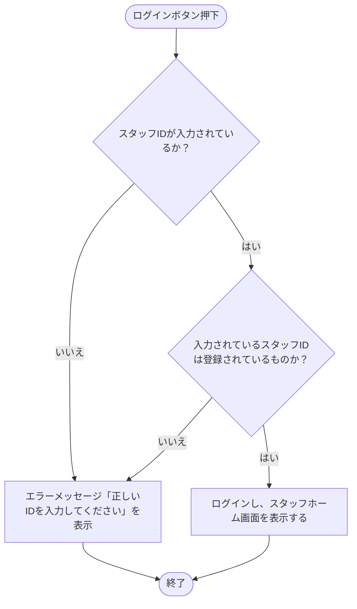

```mermaid
graph TD

A([ログインボタン押下])　--> B{スタッフIDが入力されているか？}
B --> |はい|C{入力されているスタッフIDは登録されているものか？}
B --> |いいえ|D[エラーメッセージ「正しいIDを入力してください」を表示]

C --> |はい|E[ログインし、スタッフホーム画面を表示する]
C --> |いいえ|D

D --> F
E --> F([終了])
```