#### 利用者蔵書検索

```mermaid
%%{init: {'flowchart': {'curve': 'linear'}}}%%
flowchart LR
    A([検索ボタン押下]) --> B[検索キーワード確認]
    B --> C{検索条件が1項目以上入力されている？}

    C --> |はい|D{入力されている項目は99文字以内か？}
    C -->|いいえ| F[エラーメッセージ「検索内容を⼊⼒してください」を表示]

    D -->|はい|E[データベースを検索し、検索結果を取得]
    D -->|いいえ| G[エラーメッセージ「100⽂字を超えた入力はできません」を表示]

    E --> H([終了])
    F --> H
    G --> H
```

#### 利用者蔵書検索結果

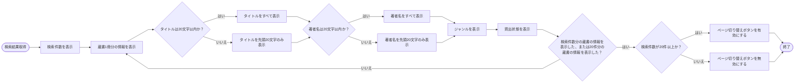
```mermaid
%%{init: {'flowchart': {'curve': 'linear'}}}%%
flowchart LR
    A([検索結果取得]) --> B[検索件数を表示]
    B --> C[蔵書1冊分の情報を表示]

    C --> D{タイトルは20文字以内か？}
    D --> |はい|E[タイトルをすべて表示]
    D --> |いいえ|F[タイトルを先頭20文字のみ表示]

    E --> G{著者名は20文字以内か？}
    F --> G
    G --> |はい|H[著者名をすべて表示]
    G --> |いいえ|I[著者名を先頭20文字のみ表示]

    H --> J[ジャンルを表示]
    I --> J
    J --> K[貸出状態を表示]

    K --> L{検索件数分の蔵書の情報を表示した、または20件分の蔵書の情報を表示した？}

    L --> |いいえ|C
    L --> |はい|M{検索件数が20件以上か？}
    M --> |はい|N[ページ切り替えボタンを有効にする]
    M --> |いいえ|O[ページ切り替えボタンを無効にする]

    N --> P([終了])
    O --> P
    
```

#### スタッフログイン

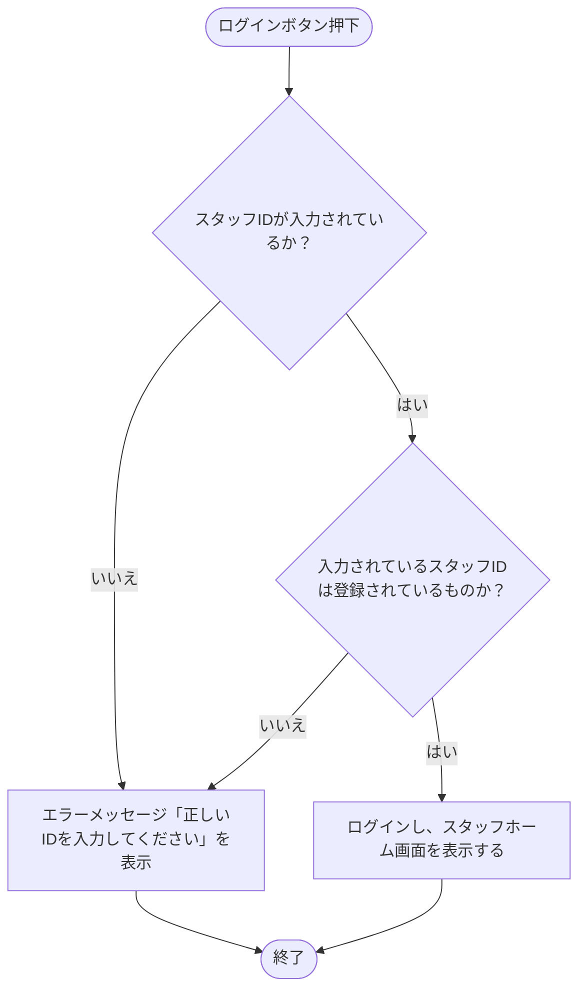
```mermaid
graph TD

A([ログインボタン押下])　--> B{スタッフIDが入力されているか？}
B --> |はい|C{入力されているスタッフIDは登録されているものか？}
B --> |いいえ|D[エラーメッセージ「正しいIDを入力してください」を表示]

C --> |はい|E[ログインし、スタッフホーム画面を表示する]
C --> |いいえ|D

D --> F
E --> F([終了])
```

#### スタッフログアウト

#### スタッフ用蔵書検索

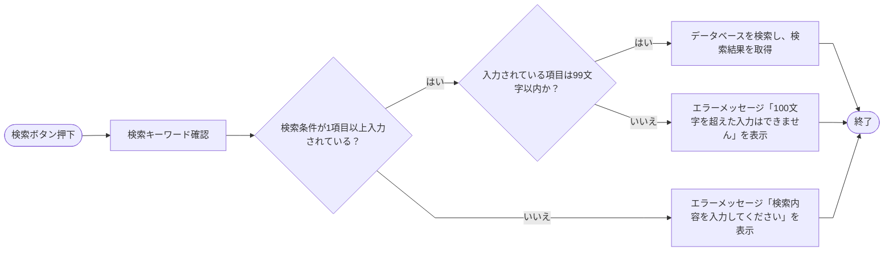
```mermaid
%%{init: {'flowchart': {'curve': 'linear'}}}%%
flowchart LR
    A([検索ボタン押下]) --> B[検索キーワード確認]
    B --> C{検索条件が1項目以上入力されている？}

    C --> |はい|D{入力されている項目は99文字以内か？}
    C -->|いいえ| F[エラーメッセージ「検索内容を⼊⼒してください」を表示]

    D -->|はい|E[データベースを検索し、検索結果を取得]
    D -->|いいえ| G[エラーメッセージ「100⽂字を超えた入力はできません」を表示]

    E --> H([終了])
    F --> H
    G --> H
```

#### スタッフ用検索結果

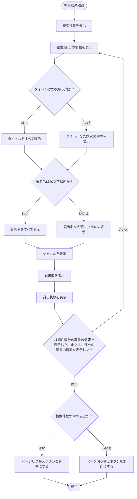
```mermaid
%%{init: {'flowchart': {'curve': 'linear'}}}%%
flowchart TD
    A([検索結果取得]) --> B[検索件数を表示]
    B --> C[蔵書1冊分の情報を表示]

    C --> D{タイトルは20文字以内か？}
    D --> |はい|E[タイトルをすべて表示]
    D --> |いいえ|F[タイトルを先頭20文字のみ表示]

    E --> G{著者名は20文字以内か？}
    F --> G
    G --> |はい|H[著者名をすべて表示]
    G --> |いいえ|I[著者名を先頭20文字のみ表示]

    H --> J[ジャンルを表示]
    I --> J
    J --> K[蔵書IDを表示]

    K --> L[貸出状態を表示]

    L --> M{検索件数分の蔵書の情報を表示した、または20件分の蔵書の情報を表示した？}

    M --> |いいえ|C
    M --> |はい|N{検索件数が20件以上か？}
    N --> |はい|O[ページ切り替えボタンを有効にする]
    N --> |いいえ|P[ページ切り替えボタンを無効にする]

    O --> Q([終了])
    P --> Q
    
```

#### 予約検索

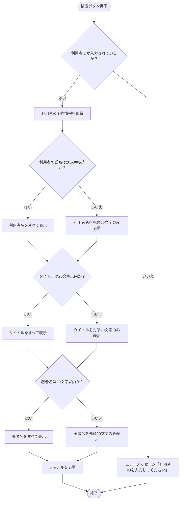
```mermaid
%%{init: {'flowchart': {'curve': 'linear'}}}%%
flowchart TD

A([検索ボタン押下]) --> B{利用者IDが入力されているか？}
B --> |はい|C[利用者の予約情報を取得]
B --> |いいえ|D[エラーメッセージ「利用者IDを入力してください」]

C --> E{利用者の氏名は20文字以内か？}
E --> |はい|F[利用者名をすべて表示]
E --> |いいえ|G[利用者名を先頭20文字のみ表示]

F --> H{タイトルは20文字以内か？}
G --> H
H --> |はい|I[タイトルをすべて表示]
H --> |いいえ|J[タイトルを先頭20文字のみ表示]

I --> K{著者名は20文字以内か？}
J --> K
K --> |はい|L[著者名をすべて表示]
K --> |いいえ|M[著者名を先頭20文字のみ表示]

L --> N[ジャンルを表示]
M --> N

N --> O([終了])
D --> O
```

#### 蔵書登録

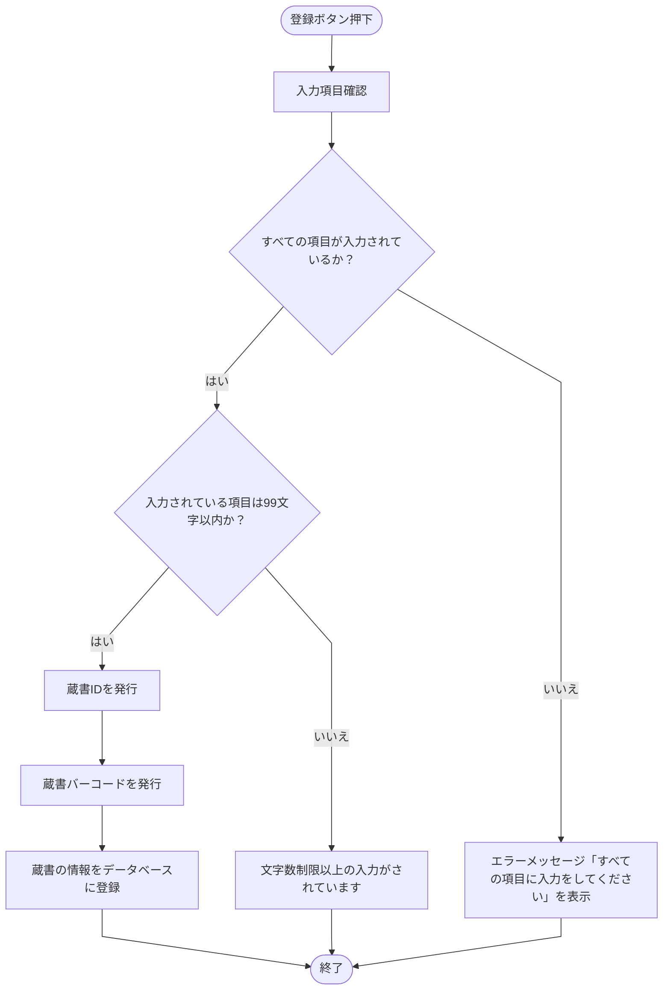
```mermaid
%%{init: {'flowchart': {'curve': 'linear'}}}%%
flowchart TD

A([登録ボタン押下]) --> B[入力項目確認]
B --> C{すべての項目が入力されているか？}
C --> |はい|D{入力されている項目は99文字以内か？}
C --> |いいえ|E[エラーメッセージ「すべての項目に入力をしてください」を表示]

D --> |はい|F[蔵書IDを発行]
D --> |いいえ|G[文字数制限以上の入力がされています]

F --> H[蔵書バーコードを発行]

H --> I[蔵書の情報をデータベースに登録]

I --> J([終了])
E --> J
G --> J
```

#### 利用者登録

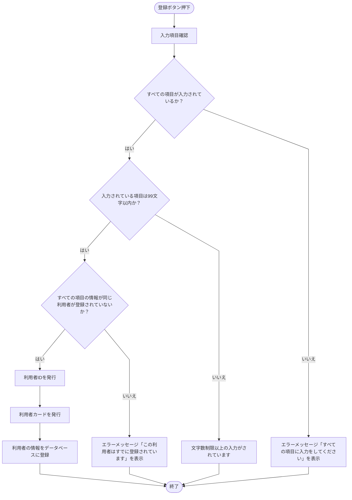
```mermaid
%%{init: {'flowchart': {'curve': 'linear'}}}%%
flowchart TD

A([登録ボタン押下]) --> B[入力項目確認]
B --> C{すべての項目が入力されているか？}
C --> |はい|D{入力されている項目は99文字以内か？}
C --> |いいえ|E[エラーメッセージ「すべての項目に入力をしてください」を表示]

D --> |はい|F{すべての項目の情報が同じ利用者が登録されていないか？}
D --> |いいえ|G[文字数制限以上の入力がされています]

F --> |はい|H[利用者IDを発行]
F --> |いいえ|I[エラーメッセージ「この利用者はすでに登録されています」を表示]

H --> J[利用者カードを発行]

J --> K[利用者の情報をデータベースに登録]

K --> L([終了])
E --> L
G --> L
I --> L
```

#### 利用者退会

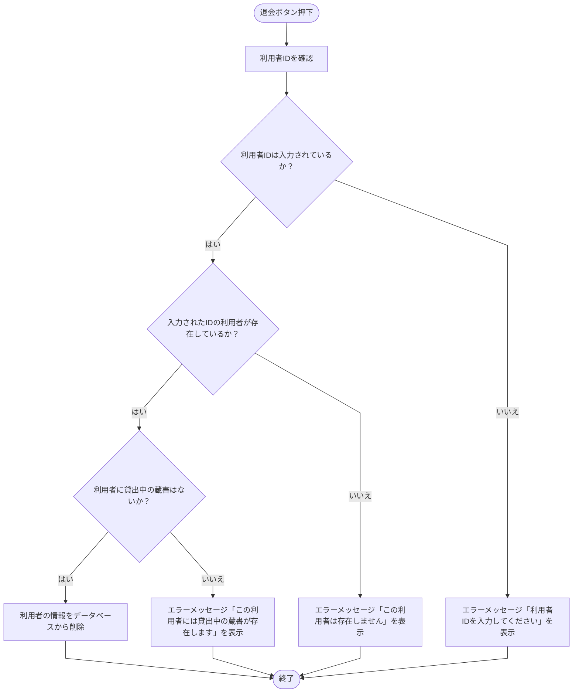
```mermaid
%%{init: {'flowchart': {'curve': 'linear'}}}%%
flowchart TD

A([退会ボタン押下]) --> B[利用者IDを確認]
B --> C{利用者IDは入力されているか？}

C --> |はい|D{入力されたIDの利用者が存在しているか？}
C --> |いいえ|E[エラーメッセージ「利用者IDを入力してください」を表示]

D --> |はい|F{利用者に貸出中の蔵書はないか？}
D --> |いいえ|G[エラーメッセージ「この利用者は存在しません」を表示]

F --> |はい|H[利用者の情報をデータベースから削除]
F --> |いいえ|I[エラーメッセージ「この利用者には貸出中の蔵書が存在します」を表示]

H --> J([終了])
E --> J
G --> J
I --> J
```

#### スタッフ登録

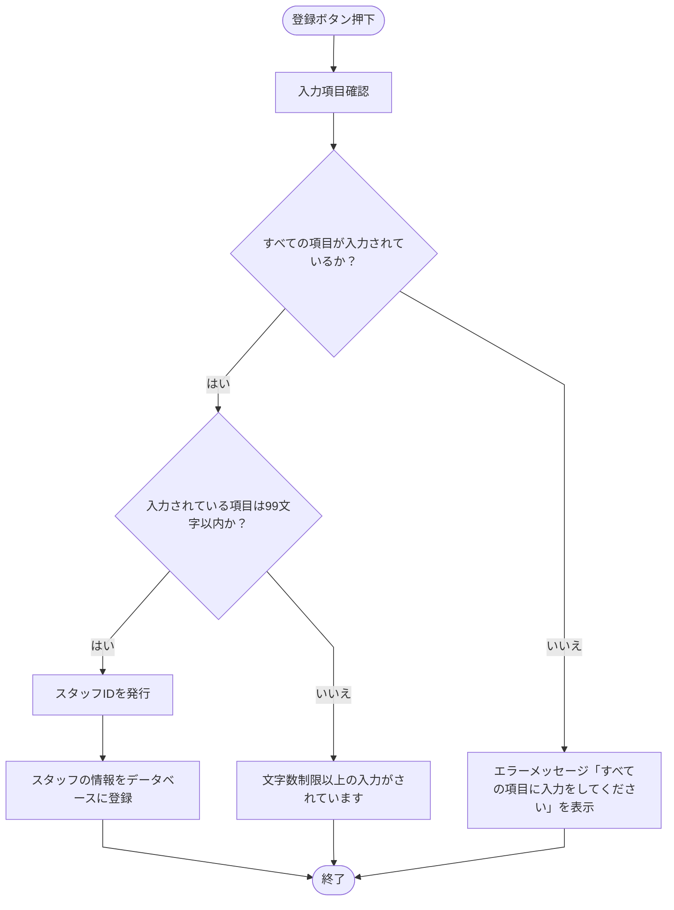
```mermaid
%%{init: {'flowchart': {'curve': 'linear'}}}%%
flowchart TD

A([登録ボタン押下]) --> B[入力項目確認]
B --> C{すべての項目が入力されているか？}
C --> |はい|D{入力されている項目は99文字以内か？}
C --> |いいえ|E[エラーメッセージ「すべての項目に入力をしてください」を表示]

D --> |はい|F[スタッフIDを発行]
D --> |いいえ|G[文字数制限以上の入力がされています]

F --> H[スタッフの情報をデータベースに登録]

H --> I([終了])
E --> I
G --> I

```

#### スタッフ退会

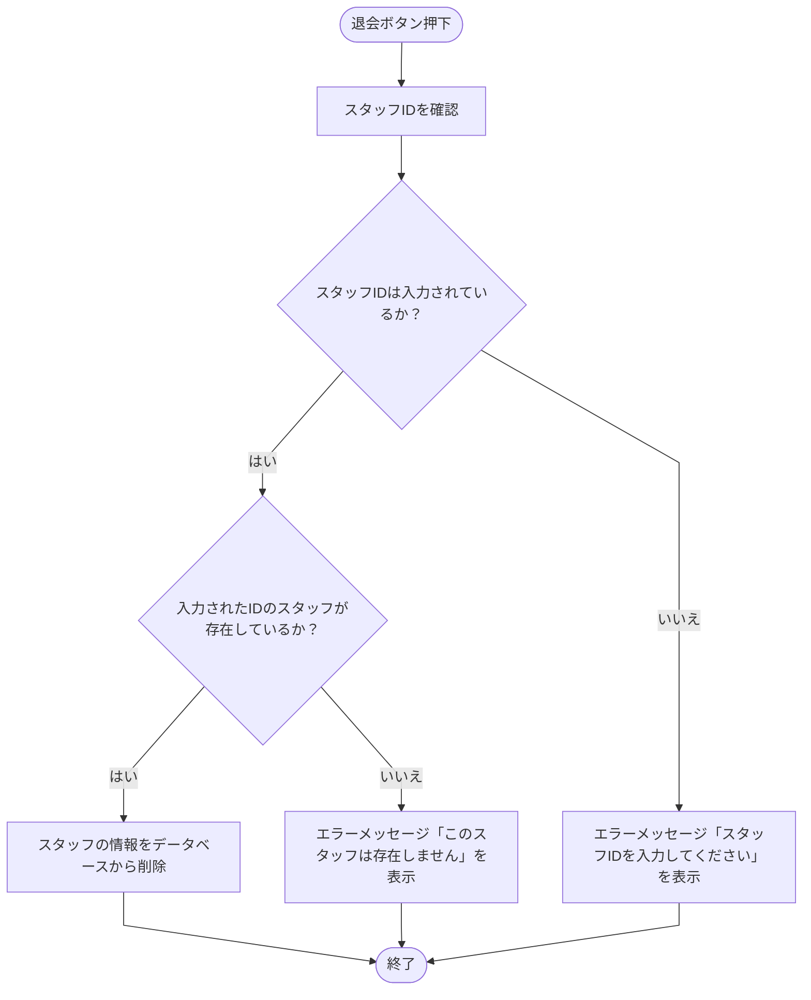
```mermaid
%%{init: {'flowchart': {'curve': 'linear'}}}%%
flowchart TD

A([退会ボタン押下]) --> B[スタッフIDを確認]
B --> C{スタッフIDは入力されているか？}

C --> |はい|D{入力されたIDのスタッフが存在しているか？}
C --> |いいえ|E[エラーメッセージ「スタッフIDを入力してください」を表示]

D --> |はい|F[スタッフの情報をデータベースから削除]
D --> |いいえ|G[エラーメッセージ「このスタッフは存在しません」を表示]

F --> H([終了])
E --> H
G --> H
```

#### 貸出処理

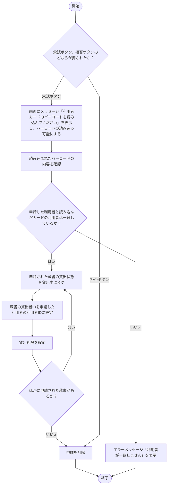
```mermaid
%%{init: {'flowchart': {'curve': 'linear'}}}%%
flowchart TD

A([開始]) --> B{承認ボタン、拒否ボタンのどちらが押されたか？}

B --> |承認ボタン|C1[画面にメッセージ「利用者カードのバーコードを読み込んでください」を表示し、バーコードの読み込み可能にする]
C1 --> D1[読み込まれたバーコードの内容を確認]

D1 --> E1{申請した利用者と読み込んだカードの利用者は一致しているか？}

E1 --> |はい|F1[申請された蔵書の貸出状態を貸出中に変更]
E1 --> |いいえ|G1[エラーメッセージ「利用者が一致しません」を表示]

F1 --> H1[蔵書の貸出者IDを申請した利用者の利用者IDに設定]

H1 --> I1[貸出期限を設定]

I1 --> J1{ほかに申請された蔵書があるか？}

J1 --> |はい|F1
J1 --> |いいえ|C

B -->|拒否ボタン|C[申請を削除]

C --> D([終了])
G1 --> D
```

#### 返却処理

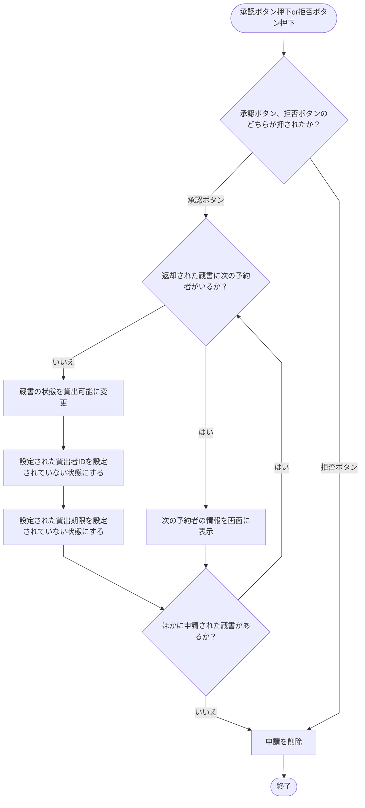
```mermaid
%%{init: {'flowchart': {'curve': 'linear'}}}%%
flowchart TD

A([承認ボタン押下or拒否ボタン押下]) --> B{承認ボタン、拒否ボタンのどちらが押されたか？}

B --> |承認ボタン|C1{返却された蔵書に次の予約者がいるか？}

C1 --> |はい|D1[次の予約者の情報を画面に表示]
C1 --> |いいえ|E1[蔵書の状態を貸出可能に変更]

E1 --> F1[設定された貸出者IDを設定されていない状態にする]

F1 --> G1[設定された貸出期限を設定されていない状態にする]

G1 --> H1{ほかに申請された蔵書があるか？}
D1 --> H1

H1 --> |はい|C1
H1 --> |いいえ|C

B -->|拒否ボタン|C[申請を削除]

C --> D([終了])
```

#### 予約通知処理

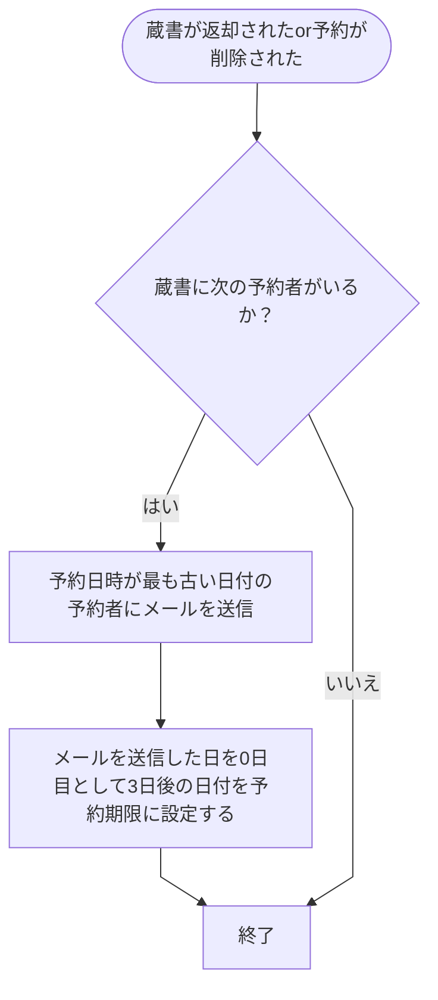
```mermaid
%%{init: {'flowchart': {'curve': 'linear'}}}%%
flowchart TD

A([蔵書が返却されたor予約が削除された]) --> B{蔵書に次の予約者がいるか？}

B --> |はい|C[予約日時が最も古い日付の予約者にメールを送信]

C --> D[メールを送信した日を0日目として3日後の日付を予約期限に設定する]

D --> E[終了]
B --> |いいえ|E
```

#### 予約取り消し

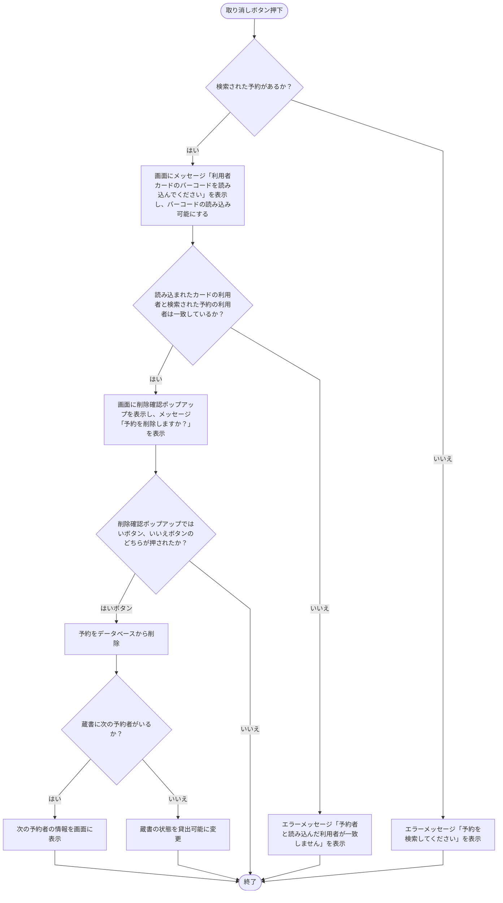
```mermaid
%%{init: {'flowchart': {'curve': 'linear'}}}%%
flowchart TD

A([取り消しボタン押下]) --> B{検索された予約があるか？}

B --> |はい|C[画面にメッセージ「利用者カードのバーコードを読み込んでください」を表示し、バーコードの読み込み可能にする]
B --> |いいえ|D[エラーメッセージ「予約を検索してください」を表示]

C --> E{読み込まれたカードの利用者と検索された予約の利用者は一致しているか？}

E --> |はい|F[画面に削除確認ポップアップを表示し、メッセージ「予約を削除しますか？」を表示]
E --> |いいえ|G[エラーメッセージ「予約者と読み込んだ利用者が一致しません」を表示]

F --> H{削除確認ポップアップではいボタン、いいえボタンのどちらが押されたか？}

H --> |はいボタン|I[予約をデータベースから削除]

I --> J{蔵書に次の予約者がいるか？}

J --> |はい|K[次の予約者の情報を画面に表示]
J --> |いいえ|L[蔵書の状態を貸出可能に変更]

K --> M([終了])
D --> M
L --> M
G --> M
H --> |いいえ|M

```

#### 予約自動取り消し

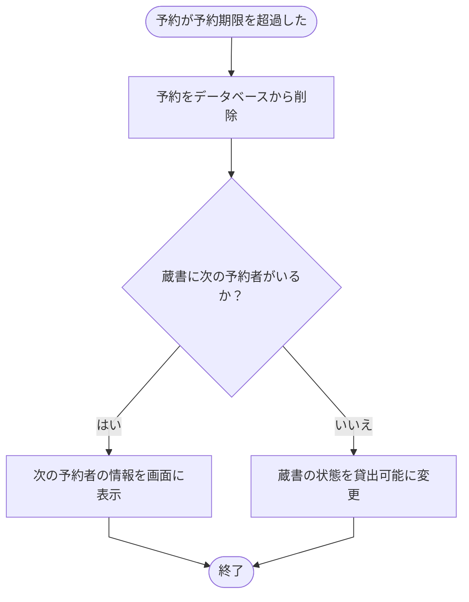
```mermaid
%%{init: {'flowchart': {'curve': 'linear'}}}%%
flowchart TD

A([予約が予約期限を超過した]) --> B[予約をデータベースから削除]
B --> C{蔵書に次の予約者がいるか？}

C --> |はい|D[次の予約者の情報を画面に表示]
C --> |いいえ|E[蔵書の状態を貸出可能に変更]

D --> F([終了])
E --> F
```

#### 貸出申請

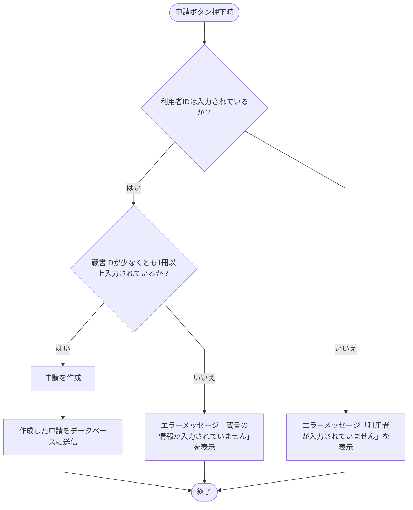
```mermaid
%%{init: {'flowchart': {'curve': 'linear'}}}%%
flowchart TD

A([申請ボタン押下時]) --> B{利用者IDは入力されているか？}

B --> |はい|C{蔵書IDが少なくとも1冊以上入力されているか？}
B --> |いいえ|D[エラーメッセージ「利用者が入力されていません」を表示]

C --> |はい|E[申請を作成]
C --> |いいえ|F[エラーメッセージ「蔵書の情報が入力されていません」を表示]

E --> G[作成した申請をデータベースに送信]

G --> H([終了])
F --> H
D --> H
```

#### 返却申請

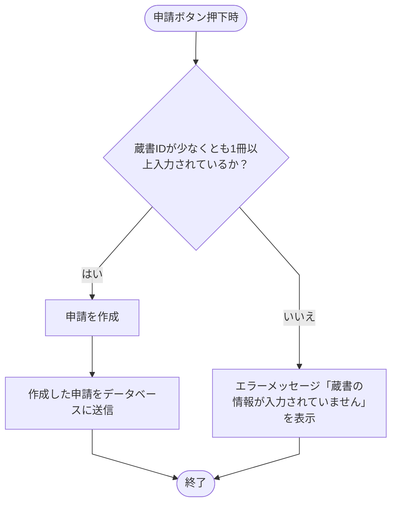
```mermaid
%%{init: {'flowchart': {'curve': 'linear'}}}%%
flowchart TD

A([申請ボタン押下時]) --> B{蔵書IDが少なくとも1冊以上入力されているか？}

B --> |はい|C[申請を作成]
B --> |いいえ|D[エラーメッセージ「蔵書の情報が入力されていません」を表示]

C --> E[作成した申請をデータベースに送信]

E --> F([終了])
D --> F
```

#### 予約申請バーコード読み込み

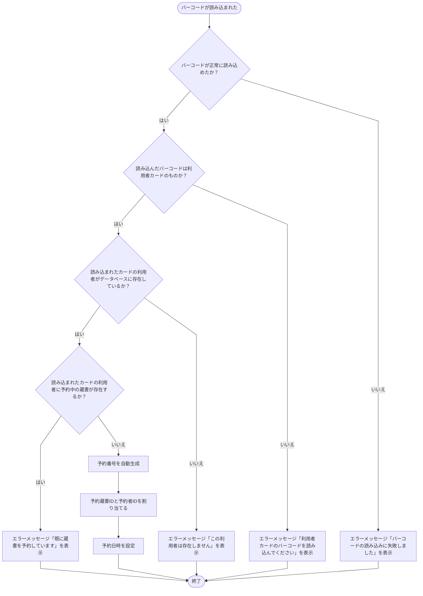
```mermaid
%%{init: {'flowchart': {'curve': 'linear'}}}%%
flowchart TD

A([バーコードが読み込まれた]) --> B{バーコードが正常に読み込めたか？}

B --> |はい|C{読み込んだバーコードは利用者カードのものか？}
B --> |いいえ|D[エラーメッセージ「バーコードの読み込みに失敗しました」を表示]

C --> |はい|E{読み込まれたカードの利用者がデータベースに存在しているか？}
C --> |いいえ|F[エラーメッセージ「利用者カードのバーコードを読み込んでください」を表示]

E --> |はい|G{読み込まれたカードの利用者に予約中の蔵書が存在するか？}
E --> |いいえ|H[エラーメッセージ「この利用者は存在しません」を表示]

G --> |はい|I[エラーメッセージ「既に蔵書を予約しています」を表示]
G --> |いいえ|J[予約番号を自動生成]

J --> K[予約蔵書IDと予約者IDを割り当てる]
K --> L[予約日時を設定]

L --> M([終了])
D --> M
F --> M
H --> M
I --> M
```

#### 貸出申請バーコード読み込み

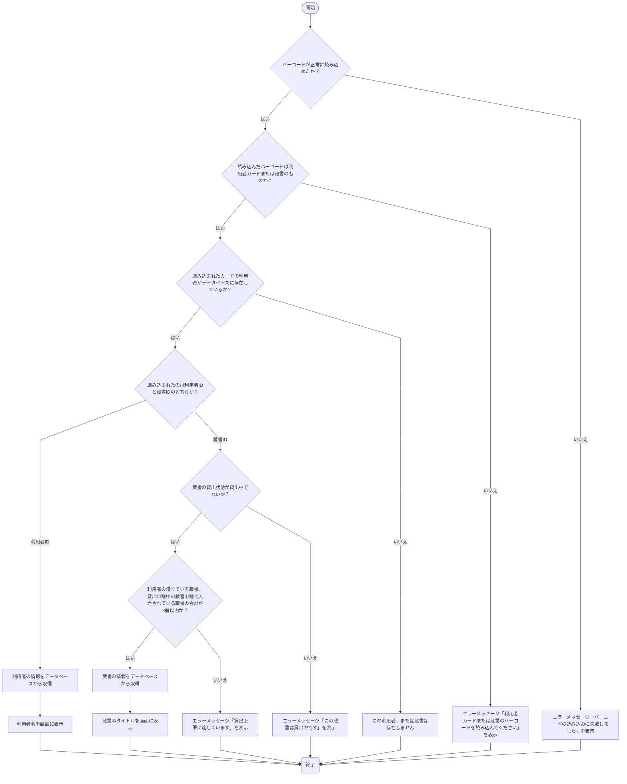
```mermaid
%%{init: {'flowchart': {'curve': 'linear'}}}%%
flowchart TD

A([開始]) --> B{バーコードが正常に読み込めたか？}

B --> |はい|C{読み込んだバーコードは利用者カードまたは蔵書のものか？}
B --> |いいえ|D[エラーメッセージ「バーコードの読み込みに失敗しました」を表示]

C --> |はい|E{読み込まれたカードの利用者がデータベースに存在しているか？}
C --> |いいえ|F[エラーメッセージ「利用者カードまたは蔵書のバーコードを読み込んでください」を表示]

E --> |はい|G{読み込まれたのは利用者IDと蔵書IDのどちらか？}
E --> |いいえ|H[この利用者、または蔵書は存在しません]

G --> |利用者ID|I1[利用者の情報をデータベースから取得]
I1 --> J1[利用者名を画面に表示]

G --> |蔵書ID|I2{蔵書の貸出状態が貸出中でないか？}

I2 --> |はい|J2{利用者の借りている蔵書、貸出申請中の蔵書申請で入力されている蔵書の合計が3冊以内か？}
I2 --> |いいえ|K2[エラーメッセージ「この蔵書は貸出中です」を表示]

J2 --> |はい|L2[蔵書の情報をデータベースから取得]
J2 --> |いいえ|M2[エラーメッセージ「貸出上限に達しています」を表示]

L2 --> N2[蔵書のタイトルを画面に表示]

N2 --> I(終了)
J1 --> I
D --> I
F --> I
H --> I
K2 --> I
M2 --> I
```