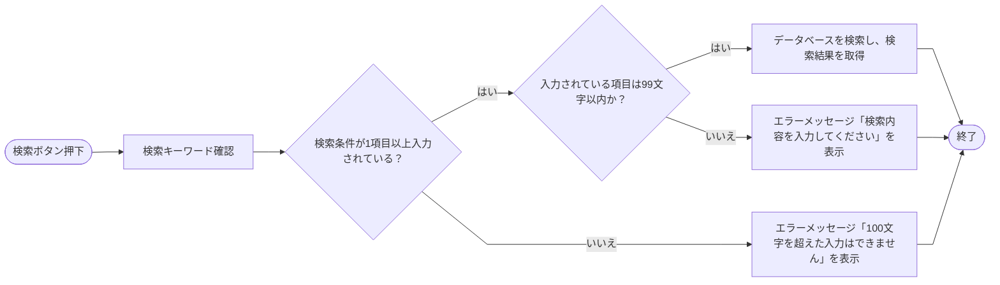
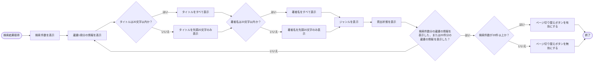
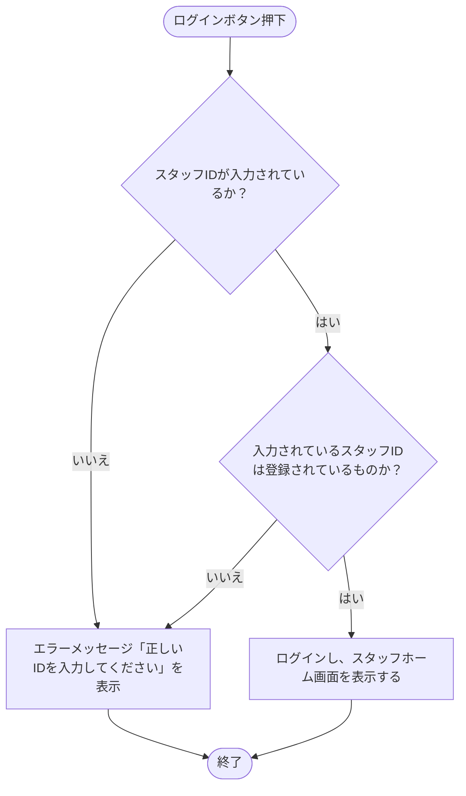

<h1>詳細設計書</h1>

<h2>目次</h2>

- [データ定義](#データ定義)
- [バリデーション定義](#バリデーション定義)
  - [利用者ソフトウェア](#利用者ソフトウェア)
  - [スタッフソフトウェア](#スタッフソフトウェア)
- [画面設計](#画面設計)
  - [利用者ソフトウェア](#利用者ソフトウェア-1)
  - [スタッフソフトウェア](#スタッフソフトウェア-1)
- [処理フロー](#処理フロー)
- [エラー定義](#エラー定義)

## データ定義

以下にシステムのデータベースで管理するデータの定義を示す

### 利用者情報

|項目名|形式|制約|
|:---|:---|:---|
|利用者ID|U-数値8桁|重複不可|
|氏名|テキスト|最大99文字|
|生年月日|YYYY-MM-DD|-|
|メールアドレス|テキスト|最大99文字|
|貸出中蔵書ID1|蔵書IDと同じ|利用者が借りている蔵書のIDが入る|
|貸出中蔵書ID2|蔵書IDと同じ|利用者が借りている蔵書のIDが入る|
|貸出中蔵書ID3|蔵書IDと同じ|利用者が借りている蔵書のIDが入る|
|予約中蔵書ID|蔵書IDと同じ|利用者が予約している蔵書のIDが入る|

### スタッフ情報

|項目名|形式|制約|
|:---|:---|:---|
|スタッフID|S-数値8桁|重複不可|
|氏名|テキスト|最大99文字|
|生年月日|YYYY-MM-DD|-|

### 蔵書情報

|項目名|形式|制約|
|:---|:---|:---|
|蔵書ID|B-数値8桁|重複不可|
|タイトル|テキスト|最大99文字|
|著者名|テキスト|最大99文字|
|ジャンル|リスト|以下のジャンルリストを使用する|
|貸出状態|-|貸出中、貸出可能の2つの状態を持つ|
|貸出者ID|利用者IDと同じ|蔵書を借りている利用者の利用者IDが入る|
|貸出期限|YYYY-MM-DD|蔵書を借りた日を0日目として14日後の日付 該当の日付が休館日の場合は次の営業日|
|予約番号|下記の予約情報の予約番号と同じ|予約している利用者の中で一番古い予約の予約番号が入る|

#### ジャンルリスト

|番号|ジャンル|
|:---|:---|
|0|総記|
|1|哲学・宗教|
|2|歴史・地理|
|3|社会科学|
|4|自然科学|
|5|技術・工学|
|6|産業|
|7|芸術・美術・スポーツ|
|8|言語|
|9|文学|

### 予約情報

|項目名|形式|制約|
|:---|:---|:---|
|予約番号|R-数値8桁|重複不可|
|予約蔵書ID|蔵書IDと同じ|予約されている蔵書の蔵書IDが入る|
|予約者ID|利用者IDと同じ|予約している利用者の利用者IDが入る|
|予約日時|YYYY-MM-DD HH:MM:SS|-|
|予約期限|YYYY-MM-DD|予約通知が行われた日を0日目として3営業日後の日付|

### 貸出申請

|項目名|形式|制約|
|:---|:---|:---|
|申請者ID|利用者IDと同じ|貸出申請をする利用者の利用者IDが入る|
|貸出蔵書ID1|蔵書IDと同じ|貸出申請をする蔵書の蔵書IDが入る|
|貸出蔵書ID2|蔵書IDと同じ|貸出申請をする蔵書の蔵書IDが入る|
|貸出蔵書ID3|蔵書IDと同じ|貸出申請をする蔵書の蔵書IDが入る|

### 返却申請

|項目名|形式|制約|
|:---|:---|:---|
|返却蔵書ID1|蔵書IDと同じ|返却申請をする蔵書の蔵書IDが入る|
|返却蔵書ID2|蔵書IDと同じ|返却申請をする蔵書の蔵書IDが入る|
|返却蔵書ID3|蔵書IDと同じ|返却申請をする蔵書の蔵書IDが入る|

## バリデーション定義

以下に各機能についての入力バリデーションについて示す

### 利用者ソフトウェア

以下に利用者ソフトウェアの機能の入力バリデーションについて示す

#### 利用者用蔵書検索

- 検索時入力項目

  |項目名|入力形式|制約|
  |:---|:---|:---|
  |タイトル|テキストボックス|100文字以上入力時は検索不可 部分一致検索|
  |著者名|テキストボックス|100文字以上入力時は検索不可 部分一致検索|
  |ジャンル|プルダウンから選択|完全一致検索|

  - いずれかの項目が入力されている場合検索を行えない
  - 複数項目入力されている場合、and検索で行う

#### 予約申請

- 申請時入力項目

  |項目名|入力形式|制約|
  |:---|:---|:---|
  |利用者ID|利用者カードのバーコードを読み込み|-|

  - 貸出状態が貸出中の蔵書に対してのみ予約申請を行うことができる
  - 同時に一冊の蔵書に対してしか予約申請を行えない

#### 貸出申請

- 申請時入力項目

  |項目名|入力形式|制約|
  |:---|:---|:---|
  |利用者ID|利用者カードのバーコードを読み込み|-|
  |蔵書ID|蔵書のバーコードを読み込み|-|

  - 貸出状態が貸出可能の蔵書に対してのみ貸出申請を行うことができる
  - 利用者が現在借りている蔵書と貸出申請中の蔵書、申請をする蔵書の合計が3冊を超える場合は申請できない

#### 返却申請

- 申請時入力項目

  |項目名|入力形式|制約|
  |:---|:---|:---|
  |蔵書ID|蔵書のバーコードを読み込み|-|

  - 貸出状態が貸出中の蔵書に対してのみ返却申請を行うことができる
  - 利用者は一度の申請で同時に3冊までしか申請を行えない

### スタッフソフトウェア

以下にスタッフソフトウェアの機能の入力バリデーションについて示す

#### スタッフログイン

- ログイン時入力項目

  |項目名|入力形式|制約|
  |:---|:---|:---|
  |スタッフID|テキストボックス|8文字まで入力可能 半角の数値のみ入力可能|

#### スタッフ用蔵書検索

- 検索時入力項目

  |項目名|入力形式|制約|
  |:---|:---|:---|
  |タイトル|テキストボックス|100文字以上入力時は検索不可 部分一致検索|
  |著者名|テキストボックス|100文字以上入力時は検索不可 部分一致検索|
  |ジャンル|プルダウンから選択|完全一致検索|
  |蔵書ID|テキストボックス|8文字まで入力可能 半角の数値のみ入力可能|

  - いずれかの項目が入力されている場合検索を行える
  - 複数項目入力されている場合、and検索で行う

#### 予約検索

- 検索時入力項目

  |項目名|入力形式|制約|
  |:---|:---|:---|
  |利用者ID|テキストボックス 利用者カードのバーコードを読み込み|8文字まで入力可能 半角の数値のみ入力可能|

#### 予約取り消し

- 予約取り消し時入力項目

  |項目名|入力形式|制約|
  |:---|:---|:---|
  |利用者ID|利用者カードのバーコードを読み込み|-|

#### 蔵書登録

- 蔵書登録時入力項目

  |項目名|入力形式|制約|
  |:---|:---|:---|
  |タイトル|テキストボックス|100文字以上入力時は登録不可|
  |著者名|テキストボックス|100文字以上入力時は登録不可|
  |ジャンル|リスト|-|

  - いずれかの項目が入力されていない場合、登録できない

#### 利用者登録

- 利用者登録時入力項目

  |項目名|入力形式|制約|
  |:---|:---|:---|
  |氏名|テキストボックス|100文字以上入力時は登録不可|
  |生年月日|カレンダー|-|
  |メールアドレス|テキストボックス|100文字以上入力時は登録不可|

  - いずれかの項目が入力されていない場合、登録できない

#### 利用者退会

- 利用者退会時入力項目

  |項目名|入力形式|制約|
  |:---|:---|:---|
  |利用者ID|テキストボックス 利用者カードのバーコードを読み込み|8文字まで入力可能 半角の数値のみ入力可能|

#### スタッフ登録

- スタッフ登録時入力項目

  |項目名|入力形式|制約|
  |:---|:---|:---|
  |氏名|テキストボックス|100文字以上入力時は登録不可|
  |生年月日|カレンダー|-|

#### スタッフ退会

- スタッフ退会時入力項目

  |項目名|入力形式|制約|
  |:---|:---|:---|
  |スタッフID|テキストボックス|8文字まで入力可能 半角の数値のみ入力可能|

## 画面設計

以下に画面設計について示す

### 利用者ソフトウェア

以下に利用者ソフトウェアの画面設計について示す

#### 利用者ホーム画面

- 画面内項目

  |項目名|形式|制約|
  |:---|:---|:---|
  |蔵書検索ボタン|ボタン|-|
  |貸出申請ボタン|ボタン|-|
  |返却申請ボタン|ボタン|-|

#### 利用者蔵書検索画面

- 画面内項目

  |項目名|形式|制約|
  |:---|:---|:---|
  |タイトル入力欄|テキストボックス|-|
  |著者名入力欄|テキストボックス|-|
  |ジャンル選択欄|プルダウン|-|
  |検索結果数表示|テキスト|-|
  |検索結果表示|-|最大20件表示|
  |検索ボタン|ボタン|-|
  |予約ボタン|ボタン|-|
  |次ページボタン|ボタン|-|
  |前ページボタン|ボタン|-|
  |戻るボタン|ボタン|-|

- 検索結果表示詳細

  |項目名|形式|制約|
  |:---|:---|:---|
  |タイトル|テキスト|先頭の20文字のみ表示|
  |著者名|テキスト|先頭の20文字のみ表示|
  |ジャンル|テキスト|-|
  |貸出状態|テキスト|-|

  - 検索結果数が20件を超える場合は、次ページボタン、前ページボタンで表示の切り替えを行う

#### 予約申請画面

- 画面内項目

  |項目名|形式|制約|
  |:---|:---|:---|
  |利用者ID入力ボタン|ボタン|-|
  |利用者名|テキスト|先頭の20文字のみ表示|
  |申請ボタン|ボタン|-|
  |戻るボタン|ボタン|-|

  - 利用者ID入力ボタン選択時は画面に"利用者カードのバーコードを読み込んでください"と表示し、バーコードを読み込み可能な状態にする

#### 貸出申請画面

- 画面内項目

  |項目名|形式|制約|
  |:---|:---|:---|
  |利用者ID入力ボタン|ボタン|-|
  |蔵書ID入力ボタン|ボタン|-|
  |利用者名|テキスト|先頭の20文字のみ表示|
  |タイトル|テキスト|先頭の20文字のみ表示|
  |申請ボタン|ボタン|-|
  |戻るボタン|ボタン|-|

  - 利用者ID入力ボタン選択時は画面に"利用者カードのバーコードを読み込んでください"と表示し、バーコードを読み込み可能な状態にする
  - 蔵書ID入力ボタン選択時は画面に"蔵書のバーコードを読み込んでください"と表示し、バーコードを読み込み可能な状態にする

#### 返却申請画面

- 画面内項目

  |項目名|形式|制約|
  |:---|:---|:---|
  |蔵書ID入力ボタン|ボタン|-|
  |タイトル|テキスト|先頭の20文字のみ表示|
  |申請ボタン|ボタン|-|
  |戻るボタン|ボタン|-|

  - 蔵書ID入力ボタン選択時は画面に"蔵書のバーコードを読み込んでください"と表示し、バーコードを読み込み可能な状態にする

### スタッフソフトウェア

以下にスタッフソフトウェアの画面設計について示す

#### スタッフログイン画面

- 画面内項目

  |項目名|形式|制約|
  |:---|:---|:---|
  |スタッフID入力欄|テキストボックス|-|
  |ログインボタン|ボタン|-|

#### スタッフホーム画面

- 画面内項目

  |項目名|形式|制約|
  |:---|:---|:---|
  |蔵書検索ボタン|ボタン|-|
  |蔵書管理ボタン|ボタン|-|
  |ユーザー登録ボタン|ボタン|-|
  |ユーザー退会ボタン|ボタン|-|
  |予約管理ボタン|ボタン|-|
  |貸出処理ボタン|ボタン|-|
  |返却処理ボタン|ボタン|-|
  |ログアウトボタン|ボタン|-|

#### スタッフ用蔵書検索画面

- 画面内項目

  |項目名|形式|制約|
  |:---|:---|:---|
  |タイトル入力欄|テキストボックス|-|
  |著者名入力欄|テキストボックス|-|
  |ジャンル選択欄|プルダウン|-|
  |蔵書ID入力欄|テキストボックス|-|
  |検索結果数表示|テキスト|-|
  |検索結果表示|-|最大20件表示|
  |検索ボタン|ボタン|-|
  |予約ボタン|ボタン|-|
  |次ページボタン|ボタン|-|
  |前ページボタン|ボタン|-|
  |戻るボタン|ボタン|-|

- 検索結果表示詳細

  |項目名|形式|制約|
  |:---|:---|:---|
  |タイトル|テキスト|先頭の20文字のみ表示|
  |著者名|テキスト|先頭の20文字のみ表示|
  |ジャンル|テキスト|-|
  |蔵書ID|テキスト|-|
  |貸出状態|テキスト|-|

  - 検索結果数が20件を超える場合は、次ページボタン、前ページボタンで表示の切り替えを行う

#### 蔵書管理画面

- 画面内項目

  |項目名|形式|制約|
  |:---|:---|:---|
  |タイトル入力欄|テキストボックス|-|
  |著者名入力欄|テキストボックス|-|
  |ジャンル選択欄|プルダウン|-|
  |登録ボタン|ボタン|-|
  |戻るボタン|ボタン|-|
  
#### ユーザー登録画面

- 画面内項目

  |項目名|形式|制約|
  |:---|:---|:---|
  |氏名入力欄|テキストボックス|-|
  |生年月日選択欄|カレンダー|-|
  |メールアドレス入力欄|テキストボックス|-|
  |利用者登録タブ|タブ|-|
  |スタッフ登録タブ|タブ|-|
  |戻るボタン|ボタン|-|
  |登録ボタン|ボタン|-|

  - 利用者登録タブ、スタッフ登録タブを押すことでそれぞれ利用者の登録、スタッフの登録を行うことができる
  - メールアドレス入力欄は利用者登録の際にしか表示されない

#### ユーザー退会画面

- 画面内項目

  |項目名|形式|制約|
  |:---|:---|:---|
  |利用者ID入力欄|テキストボックス|-|
  |スタッフID入力欄|テキストボックス|-|
  |利用者退会タブ|タブ|-|
  |スタッフ退会タブ|タブ|-|
  |戻るボタン|ボタン|-|
  |退会ボタン|ボタン|-|

  - 利用者退会タブ、スタッフ退会タブを押すことでそれぞれ利用者の退会、スタッフの退会を行うことができる
  - 利用者ID入力欄は利用者退会、スタッフID入力欄はスタッフ退会の際にしか表示されない

#### 予約管理画面

- 画面内項目

  |項目名|形式|制約|
  |:---|:---|:---|
  |利用者ID入力ボタン|ボタン|-|
  |利用者ID入力欄|テキストボックス|-|
  |検索ボタン|ボタン|-|
  |取り消しボタン|ボタン|-|
  |戻るボタン|ボタン|-|
  |予約した利用者の氏名|テキスト|先頭の20文字のみ表示|
  |タイトル|テキスト|先頭の20文字のみ表示|
  |著者名|テキスト|先頭の20文字のみ表示|
  |ジャンル|テキスト|-|

  - 取り消しボタン押下時には削除確認ポップアップを表示する

  - 削除確認ポップアップ
  |項目名|形式|制約|
  |:---|:---|:---|
  |はいボタン|ボタン|-|
  |いいえボタン|ボタン|-|

  - 利用者ID入力ボタン、取り消しボタン押下時は画面に"利用者カードのバーコードを読み込んでください"と表示し、バーコードを読み込み可能な状態にする
  - 予約した利用者の氏名、タイトル、著者名、ジャンルは検索後に表示される

#### 貸出処理画面

- 画面内項目

  |項目名|形式|制約|
  |:---|:---|:---|
  |貸出申請|-|最大20件表示|
  |次ページボタン|ボタン|-|
  |前ページボタン|ボタン|-|
  |戻るボタン|ボタン|-|

- 貸出申請詳細

  |項目名|形式|制約|
  |:---|:---|:---|
  |貸出申請した利用者の氏名|テキスト|先頭の20文字のみ表示|
  |タイトル1|テキスト|先頭の20文字のみ表示|
  |タイトル2|テキスト|先頭の20文字のみ表示|
  |タイトル3|テキスト|先頭の20文字のみ表示|
  |承認ボタン|ボタン|-|
  |拒否ボタン|ボタン|-|

  - 承認ボタン選択時は画面に"利用者カードのバーコードを読み込んでください"と表示し、バーコードを読み込み可能な状態にする
  - 申請が20件を超える場合は、次ページボタン、前ページボタンで表示の切り替えを行う

#### 返却処理画面

- 画面内項目

  |項目名|形式|制約|
  |:---|:---|:---|
  |返却申請|-|最大20件表示|
  |次ページボタン|ボタン|-|
  |前ページボタン|ボタン|-|
  |戻るボタン|ボタン|-|

  - 返却処理後に次の予約者の情報を確認するポップアップを表示する

- ポップアップ内項目

  |項目名|形式|制約|
  |:---|:---|:---|
  |予約者氏名|テキスト|先頭の20文字のみ表示|
  |予約された蔵書のタイトル|テキスト|先頭の20文字のみ表示|
  |閉じるボタン|ボタン|-|

  - 次の予約者がいない場合はポップアップには「予約はありません」というメッセージと閉じるボタンのみが表示される

- 返却申請詳細

  |項目名|形式|制約|
  |:---|:---|:---|
  |タイトル1|テキスト|先頭の20文字のみ表示|
  |タイトル2|テキスト|先頭の20文字のみ表示|
  |タイトル3|テキスト|先頭の20文字のみ表示|
  |承認ボタン|ボタン|-|
  |拒否ボタン|ボタン|-|

  - 申請が20件を超える場合は、次ページボタン、前ページボタンで表示の切り替えを行う

## 処理フロー

以下に機能ごとの処理フローについて示す

### 利用者ソフトウェア

以下に利用者ソフトウェアの機能の処理フローについて示す

#### 利用者蔵書検索

- 機能動作画面：利用者蔵書検索画面
- 動作条件：検索ボタン押下時

- 入力：入力された検索キーワード

- 処理：

- 出力:データベースから取得した検索結果

#### 利用者蔵書検索結果

- 機能動作画面：利用者蔵書検索画面
- 動作条件：利用者蔵書検索で検索結果を取得

- 入力：利用者蔵書検索で取得した検索結果

- 処理：

- 出力：なし

#### 予約申請

- 機能動作画面：予約申請画面
- 動作条件：申請ボタンを押下

- 入力：選択された蔵書の蔵書ID、入力された利用者ID

- 処理：

#### 貸出申請

- 機能動作画面：貸出申請画面

#### 返却申請

- 機能動作画面：返却申請画面

### スタッフソフトウェア

#### スタッフログイン

- 機能動作画面：スタッフログイン画面

#### スタッフログアウト

- 機能動作画面：スタッフホーム画面

#### スタッフ用蔵書検索

- 機能動作画面：スタッフ用蔵書検索画面

#### スタッフ用蔵書検索結果

- 機能動作画面：スタッフ用蔵書検索画面

#### 予約検索

- 機能動作画面：予約管理画面

#### 予約取り消し

- 機能動作画面：予約管理画面

#### 蔵書登録

- 機能動作画面：蔵書管理画面

#### 利用者登録

- 機能動作画面：ユーザー登録画面

#### 利用者退会

- 機能動作画面：ユーザー退会画面

#### スタッフ登録

- 機能動作画面：ユーザー登録画面

#### スタッフ退会

- 機能動作画面：ユーザー退会画面

#### 貸出処理

- 機能動作画面：貸出処理画面

#### 返却処理

- 機能動作画面：返却処理画面

#### 予約通知処理

- 機能動作画面：なし

#### 予約自動取り消し

- 機能動作画面：なし

## エラー定義

